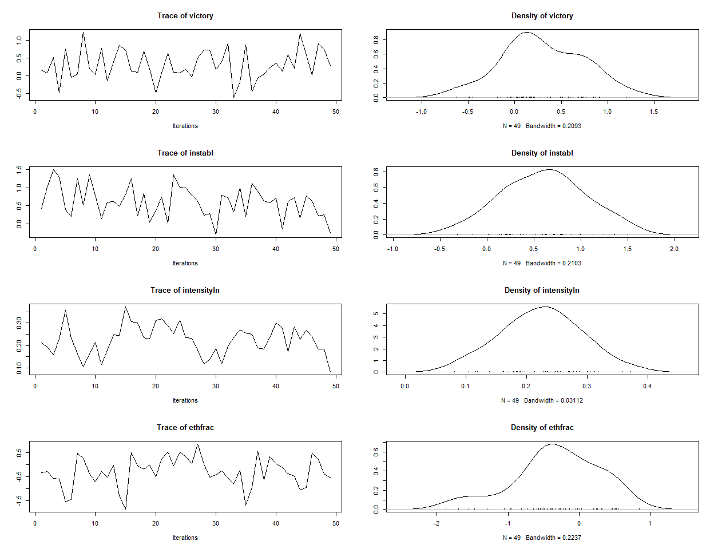
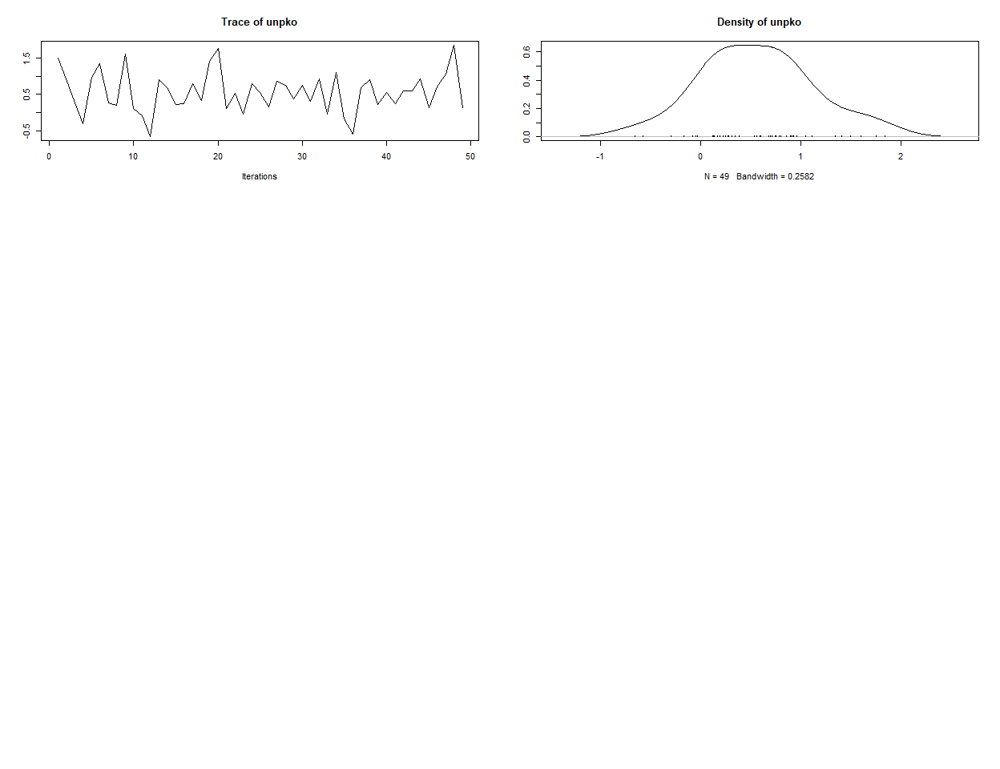
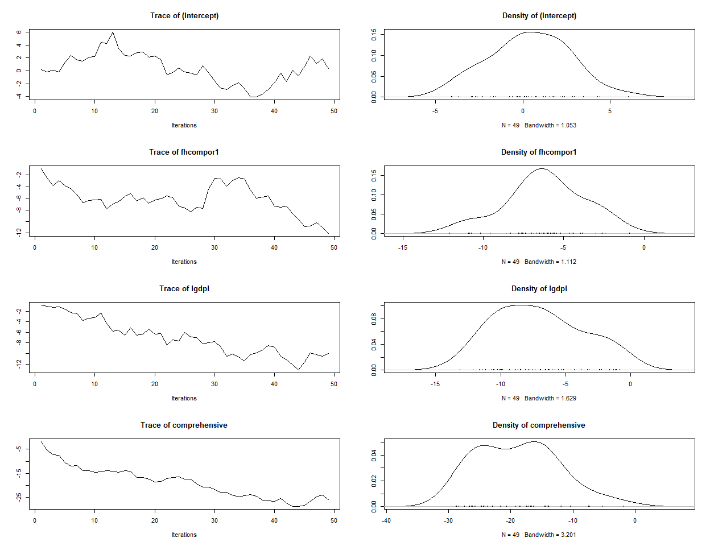
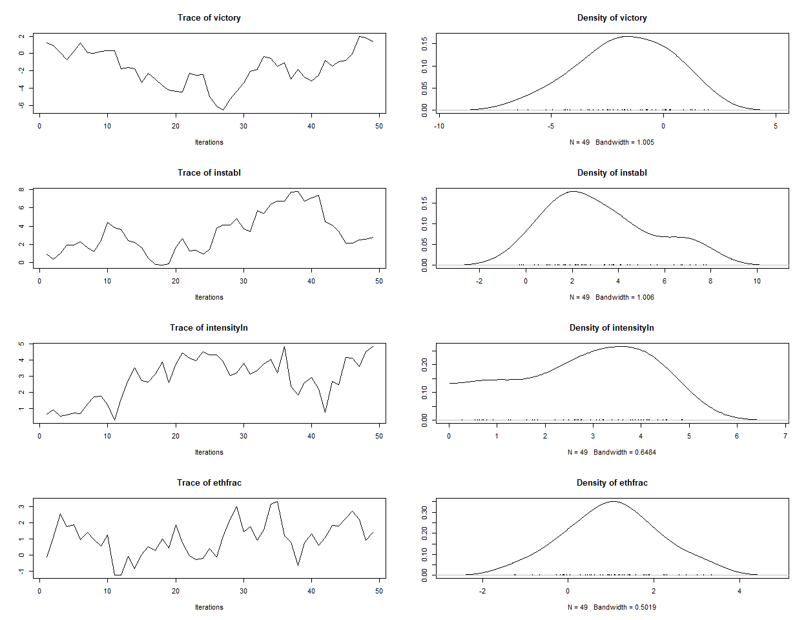
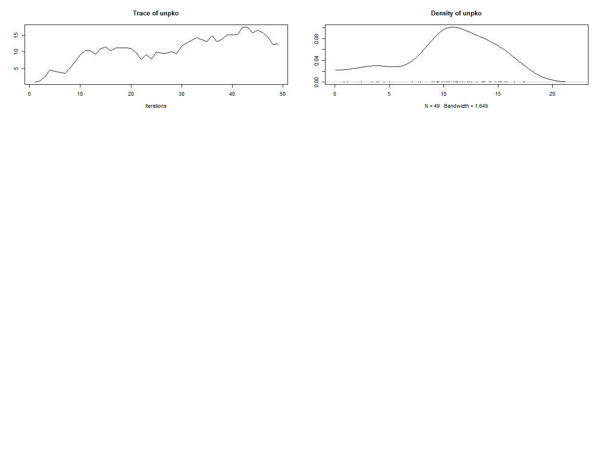

<!-- README.md is generated from README.Rmd. Please edit that file -->

# spatialSPsurv

<!-- badges: start -->

[](https://github.com/Nicolas-Schmidt/spatialSPsurv/actions)
[](https://www.repostatus.org/#active)
[](https://opensource.org/licenses/MIT)
[](https://github.com/Nicolas-Schmidt/BayesMFSurv)
<!-- badges: end -->

Bayesian Spatial Split Population Survival Model

Manual
[**here**](https://github.com/Nicolas-Schmidt/spatialSPsurv/blob/master/man/figures/manual_spatialSPsurv.pdf).

## Installation

``` r
source("https://install-github.me/Nicolas-Schmidt/spatialSPsurv")
```

### Functions

| Function         | Description                                                                                                                                                                                                                                                                                                                                                                                                                                    |
| ---------------- | ---------------------------------------------------------------------------------------------------------------------------------------------------------------------------------------------------------------------------------------------------------------------------------------------------------------------------------------------------------------------------------------------------------------------------------------------- |
| `exchangeSPsurv` | Markov Chain Monte Carlo (MCMC) to run Bayesian split population survival model with exchangeable frailties.                                                                                                                                                                                                                                                                                                                                   |
| `pooledSPsurv`   | Markov Chain Monte Carlo (MCMC) to run Bayesian split population survival model with no frailties.                                                                                                                                                                                                                                                                                                                                              |
| `spatialSPsurv`  | Markov Chain Monte Carlo (MCMC) to run time-varying Bayesian split population survival model with spatial frailties.                                                                                                                                                                                                                                                                                                                           |
| `summary`        | returns a summary of exchangeSPsurv, pooledSPsurv or spatialSPsurv object via `coda::summary.mcmc`.                                                                                                                                                                                                                                                                                                                                           |
| `spatial_SA`     | creates spatial weights matrix using distance between capital cities as the threshold.                                                                                                                                                                                                                                                                                                                                                                                                                                              |
| `SPstats`        | A function to calculate the deviance information criterion (DIC) and Log-likelihood for fitted model oupts of pooled, exchangeable, and spatial Split Population survival models for which a log-likelihood can be obtained, according to the formula `DIC = -2 * (L - P)`, where `L` is the log likelihood of the data given the posterior means of the parameter and `P` is the estimate of the effective number of parameters in the model. |

| argument   | `spatialSPsurv()`    | `exchangeSPsurv()`   | `pooledSPsurv()`     |
| ---------- | -------------------- | -------------------- | -------------------- |
| `duration` | :heavy\_check\_mark: | :heavy\_check\_mark: | :heavy\_check\_mark: |
| `immune`   | :heavy\_check\_mark: | :heavy\_check\_mark: | :heavy\_check\_mark: |
| `Y0`       | :heavy\_check\_mark: | :heavy\_check\_mark: | :heavy\_check\_mark: |
| `LY`       | :heavy\_check\_mark: | :heavy\_check\_mark: | :heavy\_check\_mark: |
| `data`     | :heavy\_check\_mark: | :heavy\_check\_mark: | :heavy\_check\_mark: |
| `N`        | :heavy\_check\_mark: | :heavy\_check\_mark: | :heavy\_check\_mark: |
| `burn`     | :heavy\_check\_mark: | :heavy\_check\_mark: | :heavy\_check\_mark: |
| `thin`     | :heavy\_check\_mark: | :heavy\_check\_mark: | :heavy\_check\_mark: |
| `w`        | :heavy\_check\_mark: | :heavy\_check\_mark: | :heavy\_check\_mark: |
| `m`        | :heavy\_check\_mark: | :heavy\_check\_mark: | :heavy\_check\_mark: |
| `form`     | :heavy\_check\_mark: | :heavy\_check\_mark: | :heavy\_check\_mark: |
| `prop.var` | :heavy\_check\_mark: | :heavy\_check\_mark: | :x:                  |
| `S`        | :heavy\_check\_mark: | :heavy\_check\_mark: | :x:                  |
| `A`        | :heavy\_check\_mark: | :x:                  | :x:                  |

### Example

#### Data

``` r
library(spatialSPsurv)

walter <- spduration::add_duration(Walter_2015_JCR,"renewed_war", 
                                   unitID = "id", tID = "year", 
                                   freq = "year", ongoing = FALSE)
walter <- spatialSPsurv::spatial_SA(data = walter, var_ccode = "ccode", threshold = 800L)
```

#### `spatialSPsurv`

``` r


## ~~~~~~~~~~~~~~~
## Weibull
## ~~~~~~~~~~~~~~~

set.seed(782566)

tch <- 
    spatialSPsurv(
        duration = duration ~ fhcompor1 + lgdpl + comprehensive + victory + 
                              instabl + intensityln + ethfrac + unpko,
        immune   = cured ~ fhcompor1 + lgdpl + victory,
        Y0       = 't.0',
        LY       = 'lastyear',
        S        = 'sp_id' ,
        data     = walter[[1]],
        N        = 500,
        burn     = 10,
        thin     = 10,
        w        = c(1,1,1),
        m        = 10,
        form     = "Weibull",
        prop.var = 1e-05,
        A        = walter[[2]]
    )

print(tch)
#> Call:
#> spatialSPsurv(duration = duration ~ fhcompor1 + lgdpl + comprehensive + 
#>     victory + instabl + intensityln + ethfrac + unpko, immune = cured ~ 
#>     fhcompor1 + lgdpl + victory, Y0 = "t.0", LY = "lastyear", 
#>     S = "sp_id", A = walter[[2]], data = walter[[1]], N = 500, 
#>     burn = 10, thin = 10, w = c(1, 1, 1), m = 10, form = "Weibull", 
#>     prop.var = 1e-05)
#> 
#> 
#> Iterations = 1:49
#> Thinning interval = 1 
#> Number of chains = 1 
#> Sample size per chain = 49 
#> 
#> Empirical mean and standard deviation for each variable,
#> plus standard error of the mean:
#> 
#> 
#> Duration equation: 
#>                     Mean         SD    Naive SE Time-series SE
#> (Intercept)    1.5463805 0.82766390 0.118237700     0.27559357
#> fhcompor1     -0.7085419 0.43598722 0.062283888     0.07810104
#> lgdpl         -0.0775318 0.08339529 0.011913613     0.02298703
#> comprehensive -0.7879095 0.29557936 0.042225623     0.04222562
#> victory        0.3020210 0.43003924 0.061434177     0.06599743
#> instabl        0.6061754 0.43418382 0.062026260     0.06202626
#> intensityln    0.2241309 0.06531212 0.009330304     0.01594854
#> ethfrac       -0.3194989 0.61694154 0.088134505     0.11343036
#> unpko          0.5637305 0.55782828 0.079689755     0.07968975
#> 
#> Inmune equation: 
#>                   Mean        SD  Naive SE Time-series SE
#> (Intercept) -10.571952 15.156688 2.1652411       9.124592
#> fhcompor1     1.833617  3.995950 0.5708499       1.384355
#> lgdpl        -7.219672  8.557581 1.2225116       5.394051
#> victory      -2.867696  4.902532 0.7003617       1.744085

SPstats(tch)
#> $DIC
#> [1] -40494.5
#> 
#> $Loglik
#> [1] 0

plot(tch)
```



``` r

## ~~~~~~~~~~~~~~~
## loglog
## ~~~~~~~~~~~~~~~


set.seed(782566)

tchll <- 
    spatialSPsurv(
        duration = duration ~ fhcompor1 + lgdpl + comprehensive + victory + 
                              instabl + intensityln + ethfrac + unpko,
        immune   = cured ~ fhcompor1 + lgdpl + victory,
        Y0       = 't.0',
        LY       = 'lastyear',
        S        = 'sp_id' ,
        data     = walter[[1]],
        N        = 500,
        burn     = 10,
        thin     = 10,
        w        = c(1,1,1),
        m        = 10,
        form     = "loglog",
        prop.var = 1e-05,
        A        = walter[[2]]
    )

print(tchll)
#> Call:
#> spatialSPsurv(duration = duration ~ fhcompor1 + lgdpl + comprehensive + 
#>     victory + instabl + intensityln + ethfrac + unpko, immune = cured ~ 
#>     fhcompor1 + lgdpl + victory, Y0 = "t.0", LY = "lastyear", 
#>     S = "sp_id", A = walter[[2]], data = walter[[1]], N = 500, 
#>     burn = 10, thin = 10, w = c(1, 1, 1), m = 10, form = "loglog", 
#>     prop.var = 1e-05)
#> 
#> 
#> Iterations = 1:49
#> Thinning interval = 1 
#> Number of chains = 1 
#> Sample size per chain = 49 
#> 
#> Empirical mean and standard deviation for each variable,
#> plus standard error of the mean:
#> 
#> 
#> Duration equation: 
#>                     Mean       SD  Naive SE Time-series SE
#> (Intercept)     0.366719 2.288175 0.3268821      1.3615709
#> fhcompor1      -6.164064 2.484757 0.3549652      1.0883163
#> lgdpl          -7.065474 3.347268 0.4781812      2.2677624
#> comprehensive -18.894019 6.575919 0.9394170      4.1424634
#> victory        -1.697208 2.065578 0.2950826      0.9950245
#> instabl         3.192351 2.224242 0.3177488      0.8147801
#> intensityln     2.827479 1.332139 0.1903055      0.5087400
#> ethfrac         1.031417 1.085811 0.1551158      0.3136554
#> unpko          10.612899 4.179155 0.5970221      2.6226135
#> 
#> Inmune equation: 
#>                   Mean       SD  Naive SE Time-series SE
#> (Intercept)  8.9685897 4.405826 0.6294037      3.2149975
#> fhcompor1   -0.7415713 4.350933 0.6215619      3.6932354
#> lgdpl       -3.7276698 1.306414 0.1866306      0.3863354
#> victory     -3.5637919 2.492473 0.3560675      1.4399093

SPstats(tchll)
#> $DIC
#> [1] 343542.6
#> 
#> $Loglik
#> [1] -157358.9

plot(tchll)
```



``` r
## W

tch$W
#>               [,1]         [,2]         [,3]          [,4]          [,5]
#>  [1,] -0.030750767 -0.017414232  0.002603383 -0.0140004263  0.0027399869
#>  [2,] -0.042802511 -0.019677974 -0.008866053  0.0029037713  0.0079195790
#>  [3,] -0.042430182 -0.010054268 -0.019212177  0.0161767751  0.0024409169
#>  [4,] -0.057227482  0.004310210 -0.028712062  0.0082103440  0.0060027400
#>  [5,] -0.046501100  0.005550301 -0.036345582  0.0040784093 -0.0017165586
#>  [6,] -0.035836044  0.021555945 -0.033405065  0.0257426490  0.0090661677
#>  [7,] -0.015886919  0.034264339 -0.040335837  0.0100268097  0.0274556892
#>  [8,] -0.010015867  0.018554793 -0.040036993  0.0070603266  0.0304864919
#>  [9,] -0.006348780  0.017097498 -0.048708498 -0.0017573089  0.0183990141
#> [10,] -0.006762231  0.026546600 -0.057522742  0.0188417249  0.0271972441
#> [11,]  0.001387365  0.028414467 -0.046047593  0.0068257827  0.0279096827
#> [12,]  0.001948683  0.018409332 -0.054621709 -0.0034898353  0.0181662207
#> [13,]  0.021446799  0.019938471 -0.046689769 -0.0043462978  0.0216532552
#> [14,]  0.015150741  0.028545509 -0.050071011 -0.0046492248  0.0299778111
#> [15,]  0.026986876  0.045005177 -0.049200868  0.0124410862  0.0250968822
#> [16,]  0.027572760  0.042384085 -0.058394104  0.0090998039  0.0158041754
#> [17,]  0.016772376  0.043759898 -0.065593075  0.0066608819  0.0143215344
#> [18,]  0.008822009  0.034017277 -0.053785397 -0.0035473530  0.0200141170
#> [19,]  0.001401833  0.027590751 -0.054345197  0.0020822679  0.0206851711
#> [20,] -0.003507421  0.030638396 -0.050126568 -0.0120000034  0.0209235957
#> [21,]  0.001833060  0.034925432 -0.036719642 -0.0013138996  0.0320625116
#> [22,]  0.006999847  0.037745783 -0.016975904  0.0015586949  0.0410643794
#> [23,]  0.022353519  0.050968109 -0.015316804  0.0007563244  0.0289941490
#> [24,]  0.011699545  0.062599737 -0.006136613 -0.0007890942  0.0198053135
#> [25,] -0.010166988  0.065544521 -0.004919162  0.0117043153  0.0063590456
#> [26,] -0.006862181  0.071379537  0.008692092  0.0109282194  0.0069932735
#> [27,] -0.012647211  0.060059795  0.012687715  0.0174857174  0.0155358758
#> [28,] -0.017381800  0.055992115  0.014794493  0.0130532043 -0.0029215599
#> [29,] -0.025104695  0.035274337  0.022546786 -0.0098738955 -0.0177198210
#> [30,] -0.030489051  0.036143796  0.023147347  0.0004891236 -0.0013292791
#> [31,] -0.028046318  0.024129440  0.033240662  0.0026876762  0.0039047466
#> [32,] -0.033936389  0.035815079  0.029708741 -0.0080368033  0.0207818310
#> [33,] -0.014763435  0.034846517  0.049965228 -0.0120309300  0.0087980414
#> [34,] -0.009506009  0.018802185  0.060787751 -0.0177901746 -0.0020929140
#> [35,] -0.020241126  0.020656750  0.062304077 -0.0130655312 -0.0052916260
#> [36,] -0.040540406  0.021551100  0.063443070 -0.0041599035 -0.0107599148
#> [37,] -0.041305928  0.023770921  0.073652155 -0.0038717239 -0.0069665266
#> [38,] -0.050614333  0.026451800  0.056956661 -0.0032568901  0.0004783267
#> [39,] -0.050112361  0.017621878  0.048285788 -0.0035945894  0.0002656465
#> [40,] -0.047921772  0.020500792  0.036527420 -0.0189291419 -0.0080650044
#> [41,] -0.053609456  0.027892954  0.040185926 -0.0112392446 -0.0016758180
#> [42,] -0.049647895  0.007418564  0.051397386 -0.0106127391 -0.0228753140
#> [43,] -0.044747086 -0.007845347  0.060129598 -0.0076996771 -0.0322955854
#> [44,] -0.037488935 -0.003559586  0.068815065 -0.0161529522 -0.0367540788
#> [45,] -0.021450180  0.007432389  0.073061965 -0.0061950506 -0.0408901955
#> [46,] -0.025779617  0.016745977  0.077916689 -0.0008118177 -0.0488602483
#> [47,] -0.031315794 -0.001857505  0.088813831  0.0179022850 -0.0478034749
#> [48,] -0.034472609 -0.000140481  0.098696767  0.0093772606 -0.0513422830
#> [49,] -0.033100366 -0.012591653  0.116826205  0.0110277050 -0.0493388877
#>                [,6]          [,7]        [,8]          [,9]        [,10]
#>  [1,] -0.0077412057 -0.0219046887 -0.01122684 -2.775264e-03 -0.007488321
#>  [2,]  0.0098969304 -0.0281770098 -0.01602320  1.032675e-02 -0.005369217
#>  [3,]  0.0060674318 -0.0052298629 -0.01333200  5.434713e-04 -0.016509857
#>  [4,]  0.0078987733 -0.0054119006 -0.03044223  5.914028e-03 -0.020796191
#>  [5,]  0.0088744611 -0.0068899138 -0.04534153  7.455112e-03 -0.011060156
#>  [6,] -0.0060282307 -0.0002293491 -0.04545136  9.287332e-03 -0.011516325
#>  [7,] -0.0055120825  0.0098725362 -0.05366268  1.268376e-02 -0.010603744
#>  [8,] -0.0003805658  0.0228491529 -0.05470379  7.875217e-03 -0.005258262
#>  [9,]  0.0150425875  0.0090915629 -0.04734607  1.588941e-02 -0.007532218
#> [10,]  0.0273237243  0.0030706928 -0.04724196  7.989898e-03  0.004707817
#> [11,]  0.0363236994  0.0005496817 -0.04642706 -4.452766e-03 -0.011717317
#> [12,]  0.0334449165 -0.0005647016 -0.04617161 -1.469996e-02 -0.024367223
#> [13,]  0.0201251352  0.0097948919 -0.03910932 -1.946279e-02 -0.017902186
#> [14,]  0.0143265189  0.0038420701 -0.04939054 -1.182193e-02  0.003578908
#> [15,] -0.0116023220 -0.0013104015 -0.04324423 -1.819657e-02 -0.002207944
#> [16,] -0.0068054524  0.0036914009 -0.03312715 -1.427814e-02  0.002729416
#> [17,] -0.0078403536 -0.0053406924 -0.04966922 -2.308604e-03  0.010570480
#> [18,] -0.0029408014  0.0102529079 -0.04919766  1.027593e-02 -0.001723472
#> [19,]  0.0034019298  0.0101312406 -0.07038472  6.537431e-03  0.001654401
#> [20,]  0.0145337191  0.0038472017 -0.06257889  4.727644e-04 -0.002877148
#> [21,]  0.0170286425 -0.0066403615 -0.06505542  5.361288e-03 -0.008318831
#> [22,]  0.0086200814 -0.0027313600 -0.06414239  5.046836e-03 -0.005478440
#> [23,] -0.0113205653  0.0046647250 -0.07555945  5.682142e-03  0.006901907
#> [24,] -0.0175375586  0.0304404096 -0.06884571 -1.957987e-03 -0.005106525
#> [25,] -0.0292459214  0.0317701717 -0.06362774 -1.433400e-02  0.008441085
#> [26,] -0.0403632392  0.0496558939 -0.05992719 -9.957818e-03  0.009373152
#> [27,] -0.0381082117  0.0401040832 -0.05057240 -1.430520e-02  0.005711244
#> [28,] -0.0381468647  0.0598978605 -0.03475697 -2.225696e-02  0.009170373
#> [29,] -0.0383933823  0.0624481817 -0.03863138 -1.685009e-02  0.022530934
#> [30,] -0.0366296908  0.0478962655 -0.03586348 -5.200452e-03  0.045348539
#> [31,] -0.0367128432  0.0530861757 -0.02071983  9.090424e-03  0.050004845
#> [32,] -0.0569749269  0.0482099244 -0.03624891 -3.492389e-03  0.049105517
#> [33,] -0.0737494043  0.0492226741 -0.03208052  6.025945e-05  0.034009361
#> [34,] -0.0737612231  0.0474090887 -0.04468210 -6.249343e-04  0.048524718
#> [35,] -0.0720152820  0.0488470468 -0.05483943 -1.301993e-04  0.057554207
#> [36,] -0.0683256795  0.0488624154 -0.06521267  5.651942e-03  0.037991881
#> [37,] -0.0656778754  0.0553872193 -0.05704308  2.688253e-03  0.038163629
#> [38,] -0.0739040859  0.0396668859 -0.05889924 -2.396502e-03  0.045384121
#> [39,] -0.0702970730  0.0482895415 -0.04548699 -4.909009e-03  0.050804638
#> [40,] -0.0582213935  0.0362655253 -0.03982325 -5.504386e-03  0.062181383
#> [41,] -0.0607618240  0.0299895468 -0.05148274 -2.441559e-02  0.072024194
#> [42,] -0.0483658445  0.0352556260 -0.06500895 -1.871024e-02  0.070607337
#> [43,] -0.0312568374  0.0288598084 -0.06567543 -1.430353e-02  0.076400445
#> [44,] -0.0265817504  0.0038572376 -0.06256772 -6.005765e-03  0.068048372
#> [45,] -0.0291795832  0.0068258224 -0.05854603 -8.859753e-03  0.055927142
#> [46,] -0.0115744149  0.0021127419 -0.05723140 -1.374092e-02  0.070355690
#> [47,] -0.0092676775  0.0174850785 -0.05933479 -2.246424e-02  0.062677449
#> [48,]  0.0040130300  0.0216481120 -0.04658947 -2.311708e-02  0.038470324
#> [49,]  0.0105612044  0.0119184744 -0.04295235 -3.280323e-02  0.044398918
#>               [,11]       [,12]      [,13]         [,14]        [,15]
#>  [1,]  0.0134269112 -0.01679155 0.01706132  3.539093e-03  0.036822725
#>  [2,] -0.0005411959 -0.03533370 0.01587371  5.620990e-03  0.039541075
#>  [3,]  0.0111489104 -0.04757146 0.02407214  7.697251e-03  0.032338075
#>  [4,]  0.0103557028 -0.05269460 0.02085899  5.939649e-03  0.035016589
#>  [5,]  0.0011283933 -0.04287966 0.02687815  1.898674e-02  0.043922674
#>  [6,] -0.0040696793 -0.04962746 0.02479811  1.449502e-02  0.064092170
#>  [7,] -0.0010101645 -0.05527651 0.01868815 -5.333749e-05  0.065288998
#>  [8,]  0.0013729018 -0.06589514 0.04043117  1.750367e-02  0.049747589
#>  [9,] -0.0051369152 -0.07021605 0.04406326  1.515868e-02  0.053365370
#> [10,] -0.0105817985 -0.07118888 0.03292496  1.367404e-02  0.071081732
#> [11,] -0.0011434813 -0.07271149 0.04094219  1.252473e-02  0.071875693
#> [12,] -0.0041469105 -0.07046635 0.03836065 -3.972937e-04  0.077000433
#> [13,]  0.0014276269 -0.08305722 0.04305680 -2.399646e-03  0.071280035
#> [14,]  0.0029141235 -0.10709096 0.05002381 -5.235206e-04  0.049853368
#> [15,] -0.0042393843 -0.10196190 0.05382985 -2.544467e-03  0.030724044
#> [16,]  0.0065931107 -0.10711163 0.04761893 -1.322236e-02  0.018470101
#> [17,]  0.0025532683 -0.09287169 0.04773544 -1.465983e-02  0.016474668
#> [18,] -0.0075061119 -0.07497017 0.06028551 -2.108757e-02  0.037344811
#> [19,] -0.0134447621 -0.08153985 0.06715553 -1.112985e-02  0.047751455
#> [20,] -0.0026797386 -0.09986773 0.06114426 -1.078819e-02  0.052527850
#> [21,] -0.0210422212 -0.09066414 0.04406807 -4.236243e-03  0.045461386
#> [22,] -0.0296749373 -0.07768044 0.04653602 -3.937133e-04  0.032535913
#> [23,] -0.0158244500 -0.07874499 0.05145731 -1.971474e-03  0.027941904
#> [24,] -0.0202161944 -0.07856545 0.04979843 -2.969787e-03  0.047953802
#> [25,] -0.0329762302 -0.06903814 0.06470102 -2.098692e-02  0.028817466
#> [26,] -0.0339903587 -0.06978239 0.06560885 -3.703728e-02  0.032387160
#> [27,] -0.0286877928 -0.07006481 0.06699528 -2.824631e-02  0.043185047
#> [28,] -0.0177512188 -0.06465718 0.07024177 -2.541389e-02  0.031479829
#> [29,] -0.0253198317 -0.07777069 0.06601122 -3.675718e-02  0.014988325
#> [30,] -0.0233567342 -0.06951893 0.07427608 -4.020808e-02  0.019240061
#> [31,] -0.0463277871 -0.06248893 0.07369677 -4.076935e-02  0.023058158
#> [32,] -0.0361589500 -0.05991065 0.06871945 -3.394651e-02  0.016183162
#> [33,] -0.0481775281 -0.05516593 0.06861650 -3.389987e-02  0.001985831
#> [34,] -0.0415987041 -0.05726538 0.05250518 -3.920094e-02  0.014135841
#> [35,] -0.0381829531 -0.06116005 0.05624068 -4.569812e-02  0.003439054
#> [36,] -0.0481988807 -0.05660036 0.06332259 -5.412826e-02 -0.007098261
#> [37,] -0.0509133319 -0.07109089 0.06324582 -4.680672e-02 -0.005201493
#> [38,] -0.0559696228 -0.08727943 0.06250436 -3.978452e-02  0.000539918
#> [39,] -0.0584811001 -0.07592824 0.07879138 -5.746124e-02  0.009642889
#> [40,] -0.0365801075 -0.08213886 0.07227539 -4.562326e-02  0.011699541
#> [41,] -0.0382652717 -0.07962200 0.07740660 -4.926980e-02  0.004251899
#> [42,] -0.0235799062 -0.08978729 0.07596718 -4.033284e-02 -0.008582342
#> [43,] -0.0385263064 -0.09561165 0.07694631 -4.042514e-02 -0.001950133
#> [44,] -0.0513849074 -0.09438548 0.09565497 -5.076784e-02 -0.016107322
#> [45,] -0.0619704837 -0.07737461 0.08597376 -5.714659e-02 -0.016208103
#> [46,] -0.0704468231 -0.07175411 0.07491052 -6.289798e-02 -0.003151132
#> [47,] -0.0740468268 -0.07386925 0.06164330 -4.354305e-02 -0.008861712
#> [48,] -0.0656175128 -0.08069075 0.04910147 -4.045960e-02 -0.011719559
#> [49,] -0.0579529703 -0.08629719 0.04859815 -3.197678e-02 -0.018251501
#>               [,16]        [,17]         [,18]        [,19]         [,20]
#>  [1,]  0.0120837556  0.009645944 -2.309787e-03 -0.007228142 -0.0214695180
#>  [2,]  0.0127771193  0.024399320 -6.942271e-03 -0.013099717 -0.0125148956
#>  [3,]  0.0275415204  0.025210423 -2.266598e-02 -0.003370410 -0.0256118273
#>  [4,]  0.0264918643  0.027682577 -1.642736e-02 -0.017933420 -0.0277608482
#>  [5,]  0.0263664874  0.029866387 -8.184230e-03 -0.010711931 -0.0349274826
#>  [6,]  0.0187073559  0.033628095 -1.696391e-02 -0.029197480 -0.0359710103
#>  [7,]  0.0065017741  0.029958244 -2.141040e-02 -0.058653257 -0.0400776169
#>  [8,] -0.0039421700  0.025985828 -3.438798e-02 -0.063257320 -0.0421086488
#>  [9,]  0.0021801948  0.036332514 -2.477411e-02 -0.070535081 -0.0357354020
#> [10,]  0.0120675269  0.031404535 -2.591954e-02 -0.063675559 -0.0168721937
#> [11,]  0.0144345264  0.036617646 -3.559243e-02 -0.059697586 -0.0248606848
#> [12,]  0.0215027357  0.016547588 -3.459819e-02 -0.054745440 -0.0192216498
#> [13,]  0.0272788779 -0.001284446 -2.590096e-02 -0.055776866 -0.0206338609
#> [14,]  0.0419218129  0.004643715 -2.186735e-02 -0.065546431 -0.0219587247
#> [15,]  0.0323647160 -0.005646950 -1.314284e-03 -0.063288072 -0.0142361653
#> [16,]  0.0353222017 -0.008932256 -5.502465e-03 -0.047316565 -0.0135869400
#> [17,]  0.0186097032 -0.018760032  2.087584e-05 -0.054973030 -0.0025799545
#> [18,]  0.0274243125 -0.035124488 -1.395863e-02 -0.056308264  0.0199413820
#> [19,]  0.0252436302 -0.023842508  5.844887e-03 -0.066216600  0.0002280985
#> [20,]  0.0120265897 -0.033731914  3.884524e-03 -0.067767332  0.0135065145
#> [21,] -0.0148919257 -0.031857417  2.824596e-03 -0.068826350  0.0195423568
#> [22,] -0.0083080551 -0.043181892 -1.702042e-02 -0.051125811  0.0342795076
#> [23,]  0.0019387690 -0.046162617 -3.045955e-02 -0.058810026  0.0299873735
#> [24,]  0.0037828540 -0.053293570 -3.359512e-02 -0.057763386  0.0416150946
#> [25,] -0.0005234504 -0.057523879 -2.838519e-02 -0.069724941  0.0377293593
#> [26,]  0.0120740110 -0.060981291 -4.565497e-02 -0.055225529  0.0317657684
#> [27,]  0.0223739050 -0.071926335 -5.113919e-02 -0.051024265  0.0277516120
#> [28,]  0.0331986134 -0.071871246 -3.814041e-02 -0.041209941  0.0261664310
#> [29,]  0.0389848899 -0.080797254 -3.306902e-02 -0.033778855  0.0276876203
#> [30,]  0.0467292606 -0.079969848 -3.433106e-02 -0.027484732  0.0295234952
#> [31,]  0.0433429850 -0.088452739 -3.482295e-02 -0.033203249  0.0295702658
#> [32,]  0.0493588136 -0.088477684 -3.266137e-02 -0.031159537  0.0362622951
#> [33,]  0.0502307764 -0.084677355 -2.761437e-02 -0.047066941  0.0375568378
#> [34,]  0.0582578906 -0.079878787 -2.588621e-02 -0.045271773  0.0292539223
#> [35,]  0.0732144496 -0.075551410 -2.670013e-02 -0.042059492  0.0232788173
#> [36,]  0.0835170226 -0.078242007 -2.857376e-02 -0.049391717  0.0251100303
#> [37,]  0.0958965076 -0.072598163 -3.823946e-02 -0.043853293  0.0267429005
#> [38,]  0.1119497432 -0.062601131 -3.420279e-02 -0.043926896  0.0351262161
#> [39,]  0.1108972874 -0.071633657 -4.548141e-02 -0.048456191  0.0431662239
#> [40,]  0.1232389970 -0.065929546 -4.888460e-02 -0.050627077  0.0376784129
#> [41,]  0.1088951936 -0.069330568 -6.660284e-02 -0.056755424  0.0446109120
#> [42,]  0.0995463410 -0.092086211 -5.940268e-02 -0.058875313  0.0373982559
#> [43,]  0.1100194353 -0.080965423 -7.159887e-02 -0.062977141  0.0308522686
#> [44,]  0.1080889339 -0.070404668 -7.586490e-02 -0.056001175  0.0278422751
#> [45,]  0.0992178121 -0.063208655 -7.985097e-02 -0.050399531  0.0223429099
#> [46,]  0.1024435050 -0.060896147 -8.795814e-02 -0.039907563  0.0391792403
#> [47,]  0.0937327085 -0.077702869 -9.068120e-02 -0.040720881  0.0276606361
#> [48,]  0.1018554978 -0.086921933 -8.244542e-02 -0.022086587  0.0555014566
#> [49,]  0.1108023375 -0.083409393 -6.639337e-02 -0.018954541  0.0438260835
#>              [,21]        [,22]        [,23]        [,24]         [,25]
#>  [1,]  0.001436532 -0.008586750  0.029645791 -0.021823664  0.0021361645
#>  [2,]  0.005821139 -0.008140834  0.052942007 -0.014185591  0.0011257052
#>  [3,] -0.007157473  0.007371195  0.053549167 -0.019977436  0.0069118211
#>  [4,] -0.011125037  0.034648867  0.046547444 -0.032987169  0.0135163070
#>  [5,] -0.009264617  0.031613716  0.035295297 -0.036179301  0.0069345363
#>  [6,] -0.008224327  0.054111165  0.037451285 -0.046561383 -0.0128936874
#>  [7,] -0.006099734  0.073102342  0.026544713 -0.042181681  0.0002187539
#>  [8,]  0.002639008  0.065731533  0.042018688 -0.017700309  0.0004920313
#>  [9,]  0.002704577  0.065853611  0.034526355 -0.000771114 -0.0057656341
#> [10,] -0.008434329  0.064331338  0.038640609  0.004692542 -0.0054396486
#> [11,] -0.009770526  0.071072031  0.033837167  0.009740481 -0.0124681173
#> [12,] -0.016308717  0.062609247  0.035718225  0.016635599  0.0090917588
#> [13,] -0.021900004  0.066556229  0.025556216  0.014198148 -0.0065002718
#> [14,] -0.024974765  0.070382107  0.010980599  0.015196023  0.0161790158
#> [15,]  0.002775000  0.069778315  0.010921601  0.015415108 -0.0057226032
#> [16,]  0.005967776  0.073713518  0.011015260  0.009576294 -0.0108331831
#> [17,]  0.005221750  0.063734733  0.013697676  0.002880976 -0.0013381254
#> [18,]  0.011143264  0.062850236  0.017292840 -0.007622145 -0.0048248460
#> [19,]  0.010848306  0.070757115  0.041092957 -0.013497592 -0.0336892929
#> [20,]  0.009359122  0.071159029  0.039730570 -0.001305767 -0.0394283237
#> [21,]  0.017624039  0.060765479  0.042948377  0.016968110 -0.0480382692
#> [22,]  0.008555573  0.053887830  0.037333518  0.019798744 -0.0491507089
#> [23,]  0.011902605  0.067940602  0.017781264  0.021731999 -0.0474972887
#> [24,]  0.014032016  0.071693263  0.023283365  0.021951623 -0.0495305776
#> [25,]  0.038647350  0.082720223  0.005215352  0.026925088 -0.0449791217
#> [26,]  0.031330636  0.092118533  0.003286470  0.034493730 -0.0542638899
#> [27,]  0.035187097  0.103549682  0.005372379  0.046963702 -0.0661497387
#> [28,]  0.029940082  0.114126866 -0.003080732  0.034263802 -0.0844656708
#> [29,]  0.042851150  0.112710525 -0.002325899  0.040388789 -0.0853219374
#> [30,]  0.057128865  0.112126964 -0.008584575  0.020535623 -0.0995558851
#> [31,]  0.073486249  0.111833889 -0.012520691  0.023003145 -0.1007539900
#> [32,]  0.079035365  0.106473762 -0.025345105  0.017506041 -0.1187108311
#> [33,]  0.078825278  0.120890851 -0.019930266  0.012590427 -0.1092498431
#> [34,]  0.091395793  0.120807677 -0.035033028  0.001079614 -0.1043727062
#> [35,]  0.088626027  0.149160620 -0.029578736 -0.006776010 -0.1140499359
#> [36,]  0.115062872  0.163541429 -0.032479059 -0.011543910 -0.1214299751
#> [37,]  0.108809258  0.165462425 -0.038560602 -0.006484209 -0.1272396220
#> [38,]  0.128076455  0.173986827 -0.041524169  0.015406025 -0.1435668085
#> [39,]  0.126562590  0.176967638 -0.050653569  0.015628310 -0.1427957999
#> [40,]  0.111986545  0.172916222 -0.049441449 -0.001538599 -0.1518775998
#> [41,]  0.120436179  0.182152998 -0.050189258 -0.008930014 -0.1461332506
#> [42,]  0.125576143  0.194740019 -0.045901419  0.002619139 -0.1438103609
#> [43,]  0.123877334  0.204309956 -0.049015029  0.001668748 -0.1403895471
#> [44,]  0.117029278  0.213624990 -0.056047316  0.008653538 -0.1341616887
#> [45,]  0.105277815  0.228711992 -0.048111536  0.005844951 -0.1333310354
#> [46,]  0.091534122  0.229979150 -0.050107491  0.001726770 -0.1552990719
#> [47,]  0.072359869  0.241845245 -0.040661131 -0.007039310 -0.1469708753
#> [48,]  0.071653077  0.243467814 -0.034041211 -0.020791105 -0.1501727181
#> [49,]  0.076283330  0.254970564 -0.038651395 -0.020034800 -0.1643018753
#>               [,26]         [,27]        [,28]        [,29]        [,30]
#>  [1,]  0.0391843711 -0.0003285616 -0.005074797 -0.004211375 0.0048932904
#>  [2,]  0.0238739528  0.0110256310 -0.011938650 -0.007022330 0.0176025229
#>  [3,]  0.0177822349  0.0077731224 -0.008677388 -0.001823727 0.0150785590
#>  [4,]  0.0146369224  0.0078742927 -0.014787785  0.016916354 0.0401732071
#>  [5,] -0.0021834881 -0.0018647055 -0.048564704  0.019245735 0.0478110101
#>  [6,]  0.0052629385 -0.0169492221 -0.046644327  0.037938922 0.0301292515
#>  [7,]  0.0102996131 -0.0229192775 -0.045442845  0.060139676 0.0261886768
#>  [8,]  0.0154934501 -0.0245455947 -0.040664516  0.060103446 0.0247710597
#>  [9,]  0.0094658615 -0.0272115609 -0.040419888  0.061627046 0.0090568583
#> [10,]  0.0007327209 -0.0459475009 -0.039206173  0.074220410 0.0009574761
#> [11,]  0.0190404696 -0.0568181529 -0.026403243  0.076022402 0.0061786505
#> [12,]  0.0149106645 -0.0414346867 -0.013959176  0.085175279 0.0226121270
#> [13,] -0.0061928901 -0.0409562813 -0.033689780  0.081757052 0.0482671472
#> [14,] -0.0064176777 -0.0543852785 -0.024476382  0.067931526 0.0511094872
#> [15,] -0.0186999648 -0.0448317637 -0.030608459  0.068524439 0.0585982597
#> [16,] -0.0161185650 -0.0275341724 -0.045082861  0.078840611 0.0562302330
#> [17,] -0.0067008571 -0.0457170694 -0.064790409  0.081253638 0.0747863276
#> [18,] -0.0169456240 -0.0352835562 -0.064040547  0.065914159 0.0827169812
#> [19,] -0.0198075497 -0.0350431603 -0.072786116  0.066915338 0.0776640816
#> [20,] -0.0305566786 -0.0297515188 -0.088348986  0.072205626 0.0707623236
#> [21,] -0.0417532971 -0.0273421229 -0.068652545  0.062024756 0.0706944604
#> [22,] -0.0401255915 -0.0324325729 -0.071730965  0.053379095 0.0641019804
#> [23,] -0.0507813096 -0.0233565657 -0.073054913  0.044852727 0.0580400473
#> [24,] -0.0424527713 -0.0290022568 -0.089059918  0.042705162 0.0548718100
#> [25,] -0.0240126856 -0.0219126077 -0.091754439  0.026762631 0.0537312433
#> [26,] -0.0296467644 -0.0244165584 -0.093510622  0.016404225 0.0559320718
#> [27,] -0.0071500659 -0.0140462934 -0.092474806  0.011271635 0.0560470445
#> [28,] -0.0059019939 -0.0158200577 -0.112637348  0.017797688 0.0588360938
#> [29,]  0.0011625944 -0.0208708389 -0.114488243  0.029924203 0.0659223326
#> [30,] -0.0064367817 -0.0228986232 -0.100789337  0.022196054 0.0627764333
#> [31,] -0.0006988898 -0.0326487908 -0.110722920  0.033304392 0.0636753228
#> [32,] -0.0041369833 -0.0318433321 -0.110095087  0.037638608 0.0679034665
#> [33,] -0.0094684209 -0.0230565320 -0.116810842  0.005498015 0.0736801581
#> [34,]  0.0009452297 -0.0210551552 -0.114240444  0.005044156 0.0752729997
#> [35,] -0.0019600274 -0.0297208582 -0.116193533  0.001386492 0.0851417380
#> [36,] -0.0106910398 -0.0178313812 -0.105778295  0.025651658 0.0815328335
#> [37,] -0.0041200178 -0.0219762039 -0.117743397  0.025021375 0.0775533666
#> [38,] -0.0021690276 -0.0181071892 -0.127789320  0.028741680 0.0738147112
#> [39,] -0.0039593716 -0.0023736158 -0.124798524  0.037892019 0.0728977018
#> [40,] -0.0188197159 -0.0081153890 -0.141901537  0.048375177 0.0882098977
#> [41,] -0.0027905798 -0.0110747961 -0.141577103  0.059250132 0.0789806498
#> [42,] -0.0018766681  0.0045845021 -0.120770043  0.065098129 0.0886426640
#> [43,]  0.0132448195  0.0092675382 -0.119968463  0.062132118 0.0968717497
#> [44,]  0.0178367282  0.0188888102 -0.120182609  0.052627094 0.0991903506
#> [45,]  0.0263035287  0.0258155460 -0.118220973  0.045002082 0.0959707335
#> [46,]  0.0287413630  0.0238061646 -0.119912335  0.060281268 0.1090559206
#> [47,]  0.0399027270  0.0206197715 -0.117649132  0.052470530 0.1065865408
#> [48,]  0.0477647589  0.0235559632 -0.120613684  0.064395742 0.1175642188
#> [49,]  0.0458973236  0.0349325533 -0.125658817  0.062494096 0.1229254597
#>               [,31]        [,32]         [,33]        [,34]         [,35]
#>  [1,] -0.0064353369  0.029307593 -0.0050863142 -0.018833632 -0.0083749773
#>  [2,] -0.0092401332  0.028324658 -0.0074548680 -0.024334661 -0.0085199726
#>  [3,] -0.0034393928  0.030700175 -0.0157141145 -0.008310051 -0.0118653445
#>  [4,]  0.0040577737  0.030135105 -0.0152812499 -0.011775685 -0.0254837824
#>  [5,]  0.0093011289  0.028513649 -0.0065593520 -0.012375141 -0.0600950153
#>  [6,] -0.0187600745  0.045563850 -0.0007001666 -0.036789065 -0.0621690568
#>  [7,] -0.0245210850  0.060763372 -0.0078136756 -0.046547206 -0.0505047260
#>  [8,] -0.0260479557  0.052751219 -0.0097736837 -0.054803319 -0.0496419865
#>  [9,] -0.0193848240  0.070155864 -0.0059439686 -0.068545983 -0.0394682379
#> [10,] -0.0144061712  0.061267718 -0.0056283784 -0.067665260 -0.0554183930
#> [11,] -0.0122643328  0.044657709  0.0055514385 -0.074174373 -0.0562023948
#> [12,] -0.0195065439  0.019051701  0.0071589418 -0.061485777 -0.0635580543
#> [13,] -0.0104493378  0.005947023  0.0052311251 -0.051289753 -0.0605044760
#> [14,]  0.0049897297  0.010646416  0.0184499692 -0.059810332 -0.0455805848
#> [15,]  0.0128611591  0.016262439  0.0281757431 -0.045548669 -0.0365190570
#> [16,]  0.0191488790  0.017547192  0.0225338543 -0.044239244 -0.0447316201
#> [17,]  0.0262909094  0.020393866  0.0292572703 -0.064158608 -0.0367710740
#> [18,]  0.0225256032  0.013756940  0.0307508881 -0.073463844 -0.0450100654
#> [19,]  0.0256099384  0.005512244  0.0364624099 -0.069210141 -0.0390814021
#> [20,]  0.0298831275  0.014581004  0.0421695157 -0.076374463 -0.0315172653
#> [21,]  0.0231164906  0.024809072  0.0320549295 -0.068484809 -0.0410622722
#> [22,]  0.0247512385  0.026882455  0.0328530843 -0.076666651 -0.0218690399
#> [23,]  0.0208289619  0.026978729  0.0402331041 -0.086808022 -0.0127699425
#> [24,]  0.0117033907  0.035474982  0.0341784876 -0.081703147 -0.0052585574
#> [25,]  0.0002748838  0.038486612  0.0359662734 -0.073988378  0.0044569246
#> [26,] -0.0054851512  0.035439360  0.0391178015 -0.068246237  0.0028348367
#> [27,] -0.0158372423  0.031392908  0.0434021849 -0.079600789  0.0051425417
#> [28,] -0.0018252150  0.029957481  0.0363149536 -0.062473118  0.0007061895
#> [29,]  0.0159967130  0.040220448  0.0318055359 -0.064159202 -0.0057255271
#> [30,]  0.0304959797  0.016540540  0.0377014674 -0.054889443 -0.0031244441
#> [31,]  0.0124283927  0.016207701  0.0481735345 -0.055094381 -0.0186195518
#> [32,]  0.0200737252  0.030895845  0.0679373818 -0.075579491 -0.0149651761
#> [33,]  0.0135674990  0.033995814  0.0851810092 -0.096252800 -0.0034327506
#> [34,]  0.0082672373  0.040235082  0.0810011134 -0.076808401 -0.0018240569
#> [35,] -0.0026618531  0.050381339  0.0746080380 -0.089570815 -0.0049212163
#> [36,] -0.0158319999  0.041668200  0.0668894547 -0.089179521 -0.0230888473
#> [37,] -0.0237320582  0.021535475  0.0696961765 -0.096156156 -0.0210221730
#> [38,] -0.0326236711  0.026260268  0.0719861514 -0.085230098 -0.0198778834
#> [39,] -0.0276925883  0.018477917  0.0597022835 -0.084245962 -0.0095132073
#> [40,] -0.0220275012  0.016553918  0.0603628668 -0.082610838 -0.0143129365
#> [41,] -0.0255632301  0.009903760  0.0651262264 -0.075564947 -0.0106738736
#> [42,] -0.0501954962  0.001403603  0.0536006392 -0.073057136 -0.0006248203
#> [43,] -0.0483318721 -0.004415876  0.0511600305 -0.073525002  0.0045539877
#> [44,] -0.0457076343  0.001133489  0.0495189619 -0.086582576  0.0034017135
#> [45,] -0.0489376571 -0.008750082  0.0510219269 -0.078480327  0.0007435934
#> [46,] -0.0500168867 -0.015078779  0.0480590783 -0.080755729  0.0142933788
#> [47,] -0.0376625545  0.008101416  0.0519943922 -0.088831759 -0.0005577316
#> [48,] -0.0395603061  0.024435648  0.0241452019 -0.102078033  0.0032560332
#> [49,] -0.0287811581  0.009093547  0.0035189743 -0.122145301  0.0096398136
#>             [,36]         [,37]         [,38]         [,39]         [,40]
#>  [1,] 0.014624001  6.169442e-03 -0.0232227156  0.0159216993  0.0133766415
#>  [2,] 0.009559224  4.759899e-03 -0.0285757692  0.0142303986  0.0065615327
#>  [3,] 0.010703467  1.664221e-02 -0.0147632796 -0.0004200932 -0.0071964738
#>  [4,] 0.013052066  9.298715e-03 -0.0199648735  0.0062967905 -0.0143074842
#>  [5,] 0.014572424  2.468391e-02 -0.0120721896  0.0160486085 -0.0099757258
#>  [6,] 0.008433125  1.595669e-02 -0.0030609326  0.0223893586 -0.0135882326
#>  [7,] 0.012270270  2.275961e-02 -0.0071220305  0.0473035718 -0.0149132181
#>  [8,] 0.011491313  2.669007e-02 -0.0085778498  0.0462565364 -0.0277294023
#>  [9,] 0.018787412  1.805863e-02 -0.0032782180  0.0505530687 -0.0209512170
#> [10,] 0.011927877  1.006850e-02 -0.0004759714  0.0355985844 -0.0190006901
#> [11,] 0.004077630  2.236146e-02  0.0002457905  0.0317909423 -0.0187007556
#> [12,] 0.011750701  4.014958e-02  0.0173980252  0.0375526474 -0.0149696327
#> [13,] 0.005110812  2.613740e-02  0.0203680467  0.0352587664 -0.0134244690
#> [14,] 0.005765299  3.085501e-02  0.0123775658  0.0357392753 -0.0059622835
#> [15,] 0.016254526  3.871229e-02 -0.0089829884  0.0507155371 -0.0175228361
#> [16,] 0.010041150  2.567816e-02 -0.0059446603  0.0505593176 -0.0095413296
#> [17,] 0.031230622  2.358601e-02 -0.0043841242  0.0594947565 -0.0146788238
#> [18,] 0.044006791  9.324470e-03  0.0017620803  0.0778263778 -0.0289046880
#> [19,] 0.052671705  1.932392e-03  0.0028210524  0.0871206670 -0.0135911020
#> [20,] 0.048022349 -9.425202e-05  0.0080537027  0.1022117916 -0.0241824026
#> [21,] 0.059235159 -1.430932e-02  0.0225959840  0.0985750376 -0.0067352316
#> [22,] 0.048323229 -1.931180e-02  0.0221194468  0.0866237415  0.0117818385
#> [23,] 0.042696167 -6.735757e-03  0.0278654900  0.0848045567  0.0056039074
#> [24,] 0.035283727  6.206527e-03  0.0471600789  0.0839732937 -0.0030570960
#> [25,] 0.051638174  9.473846e-03  0.0449531625  0.0780681582 -0.0057158246
#> [26,] 0.070301687  5.616138e-03  0.0292663397  0.0758867206 -0.0057415340
#> [27,] 0.063837195  3.215541e-04  0.0228479110  0.0697297207 -0.0038302725
#> [28,] 0.069984844 -5.742657e-03  0.0203910408  0.0737316808 -0.0072663783
#> [29,] 0.075711749 -8.661127e-04  0.0239985477  0.0775088703 -0.0091938677
#> [30,] 0.081753282 -1.920143e-03  0.0116950720  0.0594077476 -0.0036626662
#> [31,] 0.081804259  5.829484e-04  0.0194415814  0.0602994928 -0.0093856099
#> [32,] 0.082345741 -2.660392e-03  0.0164171912  0.0882170917 -0.0027416167
#> [33,] 0.092830347 -6.503750e-03  0.0099543154  0.0954348423 -0.0103050711
#> [34,] 0.090062494 -4.941807e-03  0.0129636801  0.0982109338 -0.0094920688
#> [35,] 0.088820154  1.732789e-04  0.0139829777  0.1124926357  0.0004980795
#> [36,] 0.093859154  4.603781e-03  0.0191243730  0.1153890266  0.0028788860
#> [37,] 0.103899059  1.252493e-02  0.0403323916  0.1128305998 -0.0153467660
#> [38,] 0.095852475  1.872101e-02  0.0234319011  0.1155679833 -0.0165056876
#> [39,] 0.082235392  2.328249e-02  0.0360401650  0.1144637723 -0.0189633349
#> [40,] 0.084167921  1.850392e-02  0.0297040762  0.1311492662 -0.0156183602
#> [41,] 0.100629482  1.350587e-02  0.0278835095  0.1352156324 -0.0335052713
#> [42,] 0.097534349  1.695604e-02  0.0326770487  0.1167406195 -0.0430639194
#> [43,] 0.108675429  2.246470e-02  0.0208539195  0.1140849134 -0.0503074163
#> [44,] 0.113421313  3.074583e-02  0.0231961090  0.1118604655 -0.0528087008
#> [45,] 0.110550838  2.973864e-02  0.0182785537  0.1029755475 -0.0563842767
#> [46,] 0.114699503  2.645360e-02  0.0130085564  0.0791884579 -0.0752287036
#> [47,] 0.106734632  3.422002e-02  0.0169045870  0.0773088120 -0.0849751106
#> [48,] 0.098209450  2.688736e-02 -0.0011201517  0.0744279549 -0.0758158249
#> [49,] 0.102265612  3.578211e-02  0.0005056324  0.0785390628 -0.0755452629
#>             [,41]         [,42]         [,43]         [,44]        [,45]
#>  [1,] -0.02092441 -0.0017137306  1.105603e-02  8.013406e-03 -0.006330669
#>  [2,] -0.01054477 -0.0076664373  1.151857e-02 -5.618856e-03  0.003399189
#>  [3,] -0.02155370 -0.0271437816  1.260717e-02 -8.591557e-03  0.011703630
#>  [4,] -0.01954384 -0.0232994525  7.708271e-03 -2.439464e-03  0.019869503
#>  [5,] -0.02359718 -0.0148839303  1.261899e-02  1.227889e-02  0.037750448
#>  [6,] -0.03116786  0.0072057160  1.631377e-02  7.965978e-03  0.049948640
#>  [7,] -0.05008639 -0.0184238213  2.865602e-02  8.183538e-03  0.045883675
#>  [8,] -0.03442283 -0.0298589785  1.514417e-02  4.032504e-03  0.051418914
#>  [9,] -0.04085158 -0.0274090099  3.681563e-04 -2.814613e-03  0.042243921
#> [10,] -0.04115323 -0.0305530808  1.220312e-05 -1.036670e-02  0.043339292
#> [11,] -0.06123117 -0.0310392108  2.130213e-03 -1.119279e-02  0.047086287
#> [12,] -0.06603788 -0.0246443492 -1.562389e-02 -9.125314e-03  0.037906412
#> [13,] -0.06144547 -0.0078065626  3.612071e-03  7.550303e-05  0.015473390
#> [14,] -0.07645167 -0.0008269334 -1.864018e-03  7.889825e-03  0.005538134
#> [15,] -0.06663164 -0.0245135447 -7.290073e-03  1.331061e-02 -0.006965100
#> [16,] -0.06937749 -0.0224591270 -1.312488e-02  1.773597e-02 -0.010329784
#> [17,] -0.07148301 -0.0240593989 -6.282733e-03  1.687477e-02 -0.004606895
#> [18,] -0.06471492 -0.0290497533 -3.341940e-02  2.259343e-02 -0.006716457
#> [19,] -0.07105006 -0.0351142396 -2.656463e-02  1.465199e-02 -0.010406320
#> [20,] -0.07454538 -0.0374440652 -2.121872e-02  2.784647e-02 -0.012804573
#> [21,] -0.07486574 -0.0266691128 -2.346324e-02  2.041014e-02 -0.022690733
#> [22,] -0.06904174 -0.0305798111 -2.934654e-02  2.264143e-02 -0.023778122
#> [23,] -0.07108691 -0.0285647140 -4.077695e-02  2.503590e-02 -0.013087207
#> [24,] -0.08397002 -0.0228932181 -5.077039e-02  2.900113e-02 -0.028958514
#> [25,] -0.08429004 -0.0122715089 -5.629585e-02  4.299178e-02 -0.046175036
#> [26,] -0.09729372 -0.0175070292 -6.011764e-02  4.589690e-02 -0.034548323
#> [27,] -0.10243486 -0.0263896770 -5.088721e-02  4.446453e-02 -0.036989698
#> [28,] -0.11787944 -0.0090276039 -4.039157e-02  3.052250e-02 -0.040166089
#> [29,] -0.11484322 -0.0078266611 -2.719509e-02  2.469054e-02 -0.023798908
#> [30,] -0.13215703 -0.0088600403 -3.902535e-02  2.651784e-02 -0.022978585
#> [31,] -0.13583465 -0.0137957195 -4.331505e-02  2.414636e-02 -0.025929330
#> [32,] -0.12989949 -0.0051539644 -5.165165e-02  2.429896e-02 -0.027283157
#> [33,] -0.11993932 -0.0047121090 -4.442304e-02  4.055705e-02 -0.031124678
#> [34,] -0.11717402  0.0005451983 -5.233368e-02  4.092019e-02 -0.045235383
#> [35,] -0.11169600 -0.0041452404 -5.560467e-02  3.489356e-02 -0.042657115
#> [36,] -0.12642208  0.0008450200 -5.254244e-02  5.114881e-02 -0.048265757
#> [37,] -0.11030109 -0.0046354939 -5.033750e-02  5.663143e-02 -0.058137007
#> [38,] -0.11276112  0.0089800343 -5.931436e-02  4.649505e-02 -0.049728310
#> [39,] -0.12391881  0.0096344310 -5.684495e-02  4.296559e-02 -0.049075057
#> [40,] -0.12877811  0.0094623632 -4.332220e-02  4.993022e-02 -0.051539653
#> [41,] -0.12758477  0.0241809709 -4.504174e-02  4.988844e-02 -0.050743603
#> [42,] -0.13734377  0.0322703207 -5.325762e-02  5.276754e-02 -0.037153034
#> [43,] -0.13846560  0.0279762885 -3.828064e-02  3.603431e-02 -0.042799001
#> [44,] -0.14928045  0.0263147244 -3.238905e-02  3.152977e-02 -0.038810057
#> [45,] -0.14314729  0.0221938414 -4.779196e-02  3.841244e-02 -0.040522056
#> [46,] -0.15336746  0.0392228018 -4.747822e-02  4.764642e-02 -0.037744723
#> [47,] -0.14876392  0.0498664247 -5.573993e-02  5.543840e-02 -0.023680988
#> [48,] -0.14580900  0.0605963379 -6.202994e-02  5.285741e-02 -0.037920067
#> [49,] -0.14833644  0.0569876367 -5.627474e-02  3.427042e-02 -0.049598590
#>             [,46]
#>  [1,] 0.018359605
#>  [2,] 0.012586943
#>  [3,] 0.018562178
#>  [4,] 0.024988832
#>  [5,] 0.012398040
#>  [6,] 0.005760693
#>  [7,] 0.002004113
#>  [8,] 0.002852077
#>  [9,] 0.010884827
#> [10,] 0.020840675
#> [11,] 0.021317356
#> [12,] 0.031043424
#> [13,] 0.041171829
#> [14,] 0.024861245
#> [15,] 0.004076602
#> [16,] 0.019719771
#> [17,] 0.033385178
#> [18,] 0.039303441
#> [19,] 0.046976273
#> [20,] 0.064007285
#> [21,] 0.058703783
#> [22,] 0.053326634
#> [23,] 0.060747207
#> [24,] 0.054219420
#> [25,] 0.067469379
#> [26,] 0.073776312
#> [27,] 0.061092016
#> [28,] 0.050618003
#> [29,] 0.037317305
#> [30,] 0.027594404
#> [31,] 0.036664159
#> [32,] 0.028182412
#> [33,] 0.026138081
#> [34,] 0.023641925
#> [35,] 0.018771355
#> [36,] 0.034670567
#> [37,] 0.025516887
#> [38,] 0.015654478
#> [39,] 0.002161087
#> [40,] 0.016462450
#> [41,] 0.019991938
#> [42,] 0.032120411
#> [43,] 0.020992908
#> [44,] 0.028717135
#> [45,] 0.037333096
#> [46,] 0.028638796
#> [47,] 0.029733076
#> [48,] 0.023674437
#> [49,] 0.037285378

## V
tch$V
#>               [,1]         [,2]         [,3]       [,4]        [,5]       [,6]
#>  [1,] -0.016596411  0.005039204 -0.012415178 0.01944061 -0.02354173 0.03030694
#>  [2,] -0.018371180 -0.017794990  0.001291630 0.02480422 -0.03741043 0.03240147
#>  [3,] -0.013015351 -0.010160190 -0.010237472 0.01344706 -0.02320275 0.03420137
#>  [4,]  0.009079705 -0.017218201  0.007727920 0.02198639 -0.01916225 0.02995980
#>  [5,]  0.001523636 -0.011838787  0.012132548 0.02327584 -0.02986863 0.03663461
#>  [6,]  0.013702445 -0.016938118  0.020331918 0.01605276 -0.02394368 0.02758068
#>  [7,]  0.019923913 -0.026005675  0.021777309 0.02239803 -0.02241703 0.04577415
#>  [8,]  0.008513042 -0.033189313  0.018463550 0.03224161 -0.01705235 0.04746877
#>  [9,]  0.004465684 -0.032759867  0.021793816 0.03089719 -0.01111642 0.05372739
#> [10,]  0.003439492 -0.028609677  0.018236171 0.02989085 -0.01739996 0.05402884
#> [11,]  0.020492708 -0.024916365  0.012700519 0.03156261 -0.03846013 0.05037711
#> [12,]  0.011822042 -0.021243917  0.017866645 0.03526056 -0.02401453 0.04240192
#> [13,]  0.014461606 -0.008324205  0.015065013 0.02103098 -0.03507840 0.05406495
#> [14,]  0.032392532 -0.014118069  0.019141774 0.01275202 -0.03868028 0.06392015
#> [15,]  0.023081368 -0.022513056  0.009712050 0.01815331 -0.03286803 0.06519088
#> [16,]  0.032337153 -0.032504528  0.005195375 0.05729380 -0.02567155 0.05455392
#> [17,]  0.019968711 -0.032771205  0.009182474 0.04929008 -0.02603728 0.04390523
#> [18,]  0.022761411 -0.033625406  0.010027892 0.04594868 -0.02764395 0.03645932
#> [19,]  0.034963880 -0.045149571  0.018275936 0.05226609 -0.02631589 0.04201172
#> [20,]  0.039530283 -0.043620301  0.017823253 0.04928538 -0.04683356 0.02306926
#> [21,]  0.040644431 -0.057192961  0.016430097 0.05314891 -0.05740413 0.04043981
#> [22,]  0.033902303 -0.052958471  0.027938018 0.06045704 -0.05806090 0.05115648
#> [23,]  0.035891157 -0.058175894  0.031662824 0.06247955 -0.06565960 0.05155682
#> [24,]  0.031617816 -0.054106675  0.046058060 0.06840793 -0.06988368 0.06785238
#> [25,]  0.036246852 -0.048992482  0.031320162 0.06635735 -0.05087905 0.06816035
#> [26,]  0.044765635 -0.070132638  0.022790913 0.06459278 -0.05244607 0.08366884
#> [27,]  0.043978230 -0.086594357  0.037184267 0.06747924 -0.04481795 0.08011055
#> [28,]  0.037974177 -0.101769739  0.046546748 0.07468318 -0.02214694 0.07481691
#> [29,]  0.053052179 -0.106294283  0.029454093 0.07570700 -0.01228350 0.06044206
#> [30,]  0.052737072 -0.089231438  0.028636789 0.06948831 -0.02791491 0.06032195
#> [31,]  0.043531695 -0.089508656  0.045838876 0.07551895 -0.04414810 0.05769524
#> [32,]  0.047560746 -0.102106657  0.064133896 0.08332163 -0.04876853 0.05645194
#> [33,]  0.049695629 -0.103516879  0.066636539 0.08863859 -0.03037499 0.07432284
#> [34,]  0.050347966 -0.104565411  0.067399163 0.07978105 -0.02131927 0.06871993
#> [35,]  0.055870923 -0.090150209  0.072080572 0.09314593 -0.03547478 0.07136772
#> [36,]  0.069239360 -0.079569257  0.060410101 0.08378562 -0.02179131 0.05028344
#> [37,]  0.068343612 -0.074338721  0.061271597 0.06874134 -0.02514344 0.04894756
#> [38,]  0.069839246 -0.072291840  0.044218818 0.06446283 -0.02565453 0.05089122
#> [39,]  0.070247205 -0.070385157  0.050371795 0.06659513 -0.02259636 0.04055715
#> [40,]  0.057706600 -0.054569190  0.067125117 0.07613884 -0.01267016 0.05968463
#> [41,]  0.048749370 -0.042251662  0.068846729 0.08833966 -0.01645907 0.05718215
#> [42,]  0.041306117 -0.020044136  0.077757964 0.09135842 -0.01394860 0.05331219
#> [43,]  0.047922144 -0.018711602  0.078146176 0.09509313 -0.02849515 0.06687802
#> [44,]  0.056072202 -0.038057907  0.069929200 0.11140378 -0.04873351 0.07049764
#> [45,]  0.067137932 -0.057213570  0.074597780 0.11200988 -0.05982842 0.05240226
#> [46,]  0.074655869 -0.039234247  0.069586774 0.11271349 -0.06350161 0.05078956
#> [47,]  0.066285302 -0.015951292  0.051820815 0.11519059 -0.07678493 0.04911607
#> [48,]  0.072659278 -0.026787953  0.061140945 0.12034549 -0.06337776 0.05636434
#> [49,]  0.062008909 -0.026683296  0.064540187 0.10563996 -0.06149307 0.06116239
#>               [,7]          [,8]          [,9]         [,10]         [,11]
#>  [1,]  0.006844825 -0.0109669362  0.0003544779 -0.0021839955  0.0014337128
#>  [2,]  0.015049640  0.0056298656  0.0160593129  0.0068610565 -0.0005868485
#>  [3,]  0.003378733 -0.0018414782  0.0153734519 -0.0060969439  0.0160687593
#>  [4,]  0.005511862  0.0060959681 -0.0067235088 -0.0214293721  0.0337891133
#>  [5,]  0.007062436  0.0112312019 -0.0191123349 -0.0069181830  0.0350753584
#>  [6,]  0.004117575  0.0239971629 -0.0054973637 -0.0073347247  0.0416843848
#>  [7,]  0.004589080  0.0269364034 -0.0136699139 -0.0091566084  0.0309687845
#>  [8,]  0.012424296  0.0140966452 -0.0078342697  0.0048472581  0.0445060866
#>  [9,] -0.001190385  0.0107444853 -0.0157140939  0.0046660787  0.0437668290
#> [10,] -0.004723159  0.0198601552 -0.0013303651 -0.0052576636  0.0454077569
#> [11,] -0.001099616  0.0329684463 -0.0058262473 -0.0008482638  0.0405890471
#> [12,]  0.010340652  0.0371076130 -0.0101069072  0.0033640462  0.0426549342
#> [13,] -0.005961710  0.0205402534 -0.0170507482 -0.0099832128  0.0483486901
#> [14,] -0.001891333  0.0128785881 -0.0266283647 -0.0163929119  0.0434028224
#> [15,]  0.004183842  0.0128235180 -0.0325908035 -0.0207936437  0.0347321720
#> [16,]  0.013377403 -0.0002153115 -0.0493987211 -0.0100804181  0.0187265151
#> [17,]  0.016848764 -0.0040330642 -0.0471125142 -0.0154481781  0.0108715813
#> [18,]  0.027674806 -0.0040117461 -0.0514624043  0.0132691042  0.0091481985
#> [19,]  0.031094262  0.0073036875 -0.0566869024  0.0233329170  0.0111583582
#> [20,]  0.017607813  0.0252863226 -0.0509144602  0.0180745399  0.0120733585
#> [21,]  0.017890296  0.0270093715 -0.0435885641  0.0155504908  0.0064084702
#> [22,]  0.006590062  0.0169206312 -0.0607267687  0.0324321008 -0.0025358579
#> [23,]  0.002864894  0.0274084573 -0.0587284958  0.0289018315  0.0067643669
#> [24,]  0.001334581  0.0156522761 -0.0329626579  0.0281768753 -0.0042711374
#> [25,]  0.007247661  0.0144088423 -0.0274481087  0.0291841738  0.0033711340
#> [26,]  0.009451682  0.0064716699 -0.0311604853  0.0310348735 -0.0106207591
#> [27,]  0.020345926 -0.0015365238 -0.0292626587  0.0387752583 -0.0076282533
#> [28,]  0.025959197 -0.0104736546 -0.0266917506  0.0466134054 -0.0205887952
#> [29,]  0.032607744  0.0022292879 -0.0222929345  0.0530565557 -0.0183029437
#> [30,]  0.035625972  0.0118459092 -0.0484244810  0.0552792215 -0.0205495607
#> [31,]  0.030391685  0.0038364973 -0.0402422003  0.0482223679 -0.0182268933
#> [32,]  0.049896700 -0.0056116534 -0.0423232909  0.0458206466 -0.0144164094
#> [33,]  0.049241437 -0.0152596514 -0.0435887233  0.0431394242 -0.0252324469
#> [34,]  0.055491696 -0.0108595020 -0.0529479129  0.0608941567 -0.0262670799
#> [35,]  0.054935483  0.0014388476 -0.0631749882  0.0482089942 -0.0321174177
#> [36,]  0.056067811  0.0132276920 -0.0578896355  0.0733124565 -0.0471387574
#> [37,]  0.064945897  0.0106977730 -0.0454876297  0.0711324842 -0.0419087601
#> [38,]  0.071926152  0.0171501000 -0.0407421452  0.0632352664 -0.0409538313
#> [39,]  0.077739934 -0.0007139097 -0.0440221413  0.0753477727 -0.0314285337
#> [40,]  0.073427479  0.0019003131 -0.0390747827  0.0804027077 -0.0450988613
#> [41,]  0.100389924 -0.0035822245 -0.0426555172  0.0807540630 -0.0698867443
#> [42,]  0.110438220 -0.0037440253 -0.0257215656  0.0662973404 -0.0861856983
#> [43,]  0.098674765 -0.0063506376 -0.0224653597  0.0496808970 -0.0916393874
#> [44,]  0.091805919 -0.0008536083 -0.0244764005  0.0458072986 -0.0868660876
#> [45,]  0.092030377 -0.0051557284 -0.0301857958  0.0522498390 -0.0667420455
#> [46,]  0.093889850  0.0050597638 -0.0358200892  0.0361401879 -0.0641432985
#> [47,]  0.106181515 -0.0185639363 -0.0223644546  0.0542224127 -0.0562613700
#> [48,]  0.086697375 -0.0155587604 -0.0239081946  0.0755859393 -0.0588013089
#> [49,]  0.091416045  0.0013416393 -0.0352164135  0.0730528721 -0.0520938355
#>            [,12]      [,13]         [,14]         [,15]        [,16]
#>  [1,] 0.02492253 0.02317714  0.0045460315 -0.0038694153 -0.003958554
#>  [2,] 0.02554865 0.04898151 -0.0013351039 -0.0067266855 -0.001533321
#>  [3,] 0.03656566 0.04394875  0.0047085488 -0.0189029054  0.006506328
#>  [4,] 0.04889168 0.03513646  0.0045585122 -0.0153418227  0.024430441
#>  [5,] 0.04738866 0.03387219  0.0014269810 -0.0021895816  0.043574486
#>  [6,] 0.05598850 0.03951642 -0.0027106437 -0.0002212859  0.036638705
#>  [7,] 0.07052028 0.04374576 -0.0135886009  0.0020453241  0.042491036
#>  [8,] 0.09112169 0.05603291 -0.0150642182 -0.0005652447  0.037968944
#>  [9,] 0.09453246 0.06062629 -0.0055547051 -0.0027776100  0.033021937
#> [10,] 0.10086518 0.06635798 -0.0109408219  0.0035281555  0.038861223
#> [11,] 0.11225752 0.06150724 -0.0042784775 -0.0050102353  0.039684751
#> [12,] 0.12922780 0.06198221  0.0051663565 -0.0112103487  0.047087860
#> [13,] 0.13600938 0.06757675  0.0048043016  0.0069759887  0.062449534
#> [14,] 0.13131429 0.07104455 -0.0100369109 -0.0113199940  0.054477289
#> [15,] 0.12962726 0.07166649 -0.0117282388 -0.0104247702  0.075188879
#> [16,] 0.12913431 0.09593338 -0.0188704036 -0.0092403707  0.071877309
#> [17,] 0.12400326 0.09842774 -0.0213062148 -0.0004035140  0.071317829
#> [18,] 0.12457395 0.09861320 -0.0028254841  0.0051921542  0.061886566
#> [19,] 0.12801396 0.09339008  0.0007914717  0.0110393965  0.046044132
#> [20,] 0.11525865 0.09609584 -0.0052782613  0.0214154625  0.048973758
#> [21,] 0.11870057 0.09587325 -0.0033002699  0.0253039141  0.039226865
#> [22,] 0.11489795 0.09409247  0.0022056813  0.0156746403  0.035080689
#> [23,] 0.12076016 0.07548342 -0.0087590658  0.0090696460  0.033874341
#> [24,] 0.12723422 0.07858401  0.0034230749  0.0057458539  0.050907470
#> [25,] 0.14234066 0.07101026  0.0146811826  0.0207249742  0.040047955
#> [26,] 0.13502590 0.07748896  0.0018511038  0.0223460315  0.043785920
#> [27,] 0.14952349 0.09648146 -0.0029539937  0.0209297848  0.043287633
#> [28,] 0.15709258 0.09587700 -0.0004469973  0.0192929290  0.050649420
#> [29,] 0.16828764 0.07897352 -0.0083198729  0.0343147397  0.061877854
#> [30,] 0.15659571 0.08494037  0.0042589829  0.0303597081  0.050693065
#> [31,] 0.13527106 0.09124488 -0.0017689191  0.0358074210  0.043925777
#> [32,] 0.13278367 0.08958787 -0.0108697547  0.0444689215  0.054019218
#> [33,] 0.14145448 0.09811683 -0.0172843044  0.0286243696  0.061123090
#> [34,] 0.14831525 0.09431101 -0.0150818159  0.0130943389  0.061934940
#> [35,] 0.15811330 0.09458038 -0.0237825564  0.0126179197  0.074481936
#> [36,] 0.16240314 0.09367715 -0.0284930089 -0.0095284025  0.071741793
#> [37,] 0.15859987 0.09450686 -0.0348372881 -0.0204852590  0.077547054
#> [38,] 0.15337939 0.09666376 -0.0287642665 -0.0186372258  0.071257292
#> [39,] 0.16119882 0.10503584 -0.0299525465 -0.0320218657  0.081144505
#> [40,] 0.16297818 0.10970546 -0.0225647268 -0.0245611931  0.076859533
#> [41,] 0.17281554 0.11888370 -0.0253298846 -0.0215941459  0.080683472
#> [42,] 0.17647921 0.10293854 -0.0309916200 -0.0251494213  0.072991642
#> [43,] 0.16775035 0.10029189 -0.0424507219 -0.0303350614  0.065930930
#> [44,] 0.15332147 0.09534598 -0.0353369042 -0.0304008612  0.078533012
#> [45,] 0.15458044 0.08281623 -0.0541493176 -0.0252000917  0.088227689
#> [46,] 0.14317598 0.08258871 -0.0708926384 -0.0164553046  0.090152470
#> [47,] 0.14318538 0.08158901 -0.0585983734 -0.0174403260  0.075676477
#> [48,] 0.13877014 0.07609397 -0.0663644356 -0.0260677184  0.066835570
#> [49,] 0.13543251 0.08609179 -0.0667179250 -0.0406378010  0.058211231
#>              [,17]       [,18]        [,19]        [,20]         [,21]
#>  [1,] -0.004023857 0.021785483 -0.007932586 -0.003397681  0.0011194322
#>  [2,] -0.021575883 0.024308970 -0.017495743  0.006378363 -0.0084191924
#>  [3,] -0.019226440 0.016381902 -0.021169162  0.005874408 -0.0187549279
#>  [4,] -0.026573215 0.013523488 -0.028606859 -0.011091649 -0.0063081848
#>  [5,] -0.013928093 0.021201887 -0.034624975 -0.022349878 -0.0212800180
#>  [6,] -0.017099307 0.007978857 -0.035499266 -0.033373106 -0.0050276299
#>  [7,] -0.025131590 0.010759477 -0.042664959 -0.027951545 -0.0246068524
#>  [8,] -0.032362075 0.011013655 -0.067279358 -0.028665909 -0.0240328987
#>  [9,] -0.034034122 0.009247866 -0.064543120 -0.020017610 -0.0272660345
#> [10,] -0.047320341 0.024231410 -0.061217457 -0.027037536 -0.0314970596
#> [11,] -0.040774380 0.027990136 -0.051492917 -0.023737451 -0.0276156856
#> [12,] -0.042469932 0.032554065 -0.071309611 -0.032751940 -0.0187441369
#> [13,] -0.039455159 0.036219503 -0.079678977 -0.028426229  0.0015004800
#> [14,] -0.042073700 0.036195051 -0.058123098 -0.036950401  0.0150606827
#> [15,] -0.043449664 0.046817318 -0.062628295 -0.029329926  0.0215061696
#> [16,] -0.051441555 0.057671470 -0.090136949 -0.035484245  0.0122063582
#> [17,] -0.052618622 0.056820936 -0.097109723 -0.036163471  0.0176118830
#> [18,] -0.055018157 0.074531291 -0.101161541 -0.037333822  0.0263180938
#> [19,] -0.064578122 0.084282446 -0.101916956 -0.033025216  0.0256083078
#> [20,] -0.053975218 0.109001880 -0.102389312 -0.041554508  0.0396044166
#> [21,] -0.049900490 0.104166146 -0.108899156 -0.048624287  0.0397843247
#> [22,] -0.035538938 0.108281154 -0.107654363 -0.051549379  0.0314226934
#> [23,] -0.033709378 0.124642334 -0.099269833 -0.053967915  0.0345117632
#> [24,] -0.052694875 0.128675939 -0.095650130 -0.058311116  0.0463840487
#> [25,] -0.050714154 0.116852837 -0.095702482 -0.042359356  0.0370571854
#> [26,] -0.047887548 0.120945600 -0.080283098 -0.039299196  0.0416672397
#> [27,] -0.055021848 0.116583784 -0.090639824 -0.043960948  0.0295537811
#> [28,] -0.063474621 0.100573398 -0.108793058 -0.041573367  0.0358529416
#> [29,] -0.070761510 0.092910584 -0.101919608 -0.045826033  0.0203785471
#> [30,] -0.074473703 0.097698685 -0.110887053 -0.057343265  0.0108909484
#> [31,] -0.060592273 0.090177271 -0.109522588 -0.062138726  0.0181448298
#> [32,] -0.059084445 0.091099647 -0.107210757 -0.060341394  0.0006815505
#> [33,] -0.051726835 0.104469391 -0.096751522 -0.059467796  0.0020927659
#> [34,] -0.051917994 0.102586878 -0.114238812 -0.046325511 -0.0066371265
#> [35,] -0.061303721 0.094099464 -0.105160193 -0.050271315  0.0053428389
#> [36,] -0.044235270 0.111558728 -0.101401540 -0.062656981 -0.0004342463
#> [37,] -0.041048783 0.115251741 -0.095194797 -0.059844359  0.0093696265
#> [38,] -0.050979733 0.125417481 -0.105816668 -0.061548238 -0.0012271627
#> [39,] -0.050725285 0.142076899 -0.103442451 -0.070634484 -0.0058030065
#> [40,] -0.042686982 0.132927267 -0.104017867 -0.053154526 -0.0145596356
#> [41,] -0.054787158 0.137334039 -0.111842771 -0.044835270 -0.0140343912
#> [42,] -0.060916408 0.137552352 -0.110005837 -0.043857151 -0.0255479556
#> [43,] -0.073704317 0.134804482 -0.107942593 -0.043131551 -0.0355114668
#> [44,] -0.085176767 0.143875128 -0.094540193 -0.039775409 -0.0238004933
#> [45,] -0.091765851 0.157253836 -0.086152563 -0.028285166 -0.0278945306
#> [46,] -0.092985528 0.139328403 -0.069469014 -0.031439048 -0.0370806768
#> [47,] -0.092863325 0.141040714 -0.080007407 -0.029192718 -0.0314147128
#> [48,] -0.099187250 0.149547653 -0.072063605 -0.015536634 -0.0323358872
#> [49,] -0.095744516 0.160036361 -0.063284460 -0.014463956 -0.0339146502
#>               [,22]         [,23]       [,24]         [,25]        [,26]
#>  [1,]  0.0026312669 -0.0217814374 -0.01829876 -0.0057495921  0.022838562
#>  [2,]  0.0023196695 -0.0199881524 -0.03531522  0.0022358767  0.025103141
#>  [3,]  0.0103543406 -0.0237443139 -0.04150899  0.0023101322  0.025250192
#>  [4,]  0.0077652103 -0.0197876703 -0.03795053 -0.0097712406  0.035069249
#>  [5,]  0.0223136029 -0.0152936407 -0.05285030  0.0019392189  0.047270055
#>  [6,]  0.0023338872 -0.0138438048 -0.04931010  0.0105553674  0.043497870
#>  [7,] -0.0005264819 -0.0206840597 -0.04989280 -0.0002644311  0.045333284
#>  [8,] -0.0137444100 -0.0247268994 -0.04077737 -0.0058639876  0.044912041
#>  [9,] -0.0088666065 -0.0190394102 -0.03696075  0.0042465915  0.059412807
#> [10,] -0.0068228167 -0.0065535504 -0.04144442 -0.0030544740  0.047759091
#> [11,] -0.0091411700  0.0095165753 -0.04619238 -0.0172056942  0.038874657
#> [12,]  0.0012968169  0.0258729488 -0.04963881 -0.0376359220  0.029171387
#> [13,] -0.0062222647  0.0176289846 -0.05040319 -0.0411183927  0.024061401
#> [14,] -0.0095174417  0.0317459639 -0.05410051 -0.0446903749 -0.001466331
#> [15,] -0.0137480234  0.0217384724 -0.06188502 -0.0422304966 -0.001791823
#> [16,] -0.0009959646  0.0145872418 -0.05589118 -0.0297962396 -0.007912254
#> [17,]  0.0019569097  0.0257709309 -0.03964666 -0.0306347043  0.006982016
#> [18,]  0.0102812059 -0.0007954057 -0.03215098 -0.0250091965 -0.002060832
#> [19,]  0.0078751894 -0.0235468917 -0.02525196 -0.0327109436  0.017278597
#> [20,]  0.0094880090 -0.0177095865 -0.03596811 -0.0536002347  0.034645310
#> [21,]  0.0029488194 -0.0178230861 -0.02870729 -0.0523055330  0.031901701
#> [22,]  0.0088089711 -0.0168935161 -0.03745903 -0.0552073378  0.025307269
#> [23,]  0.0158621086 -0.0155198385 -0.05604223 -0.0488671229  0.030124750
#> [24,]  0.0201745720 -0.0334798848 -0.03635405 -0.0577065313  0.011239779
#> [25,]  0.0351003465 -0.0355195912 -0.03690195 -0.0369800104  0.009720405
#> [26,]  0.0397389697 -0.0400513131 -0.03219146 -0.0301638382  0.019187231
#> [27,]  0.0307921363 -0.0511920708 -0.02535031 -0.0294486837  0.022873209
#> [28,]  0.0309046264 -0.0521730576 -0.02852775 -0.0398459476  0.029385963
#> [29,]  0.0194009371 -0.0503514494 -0.03260240 -0.0238305213  0.033970250
#> [30,]  0.0452636824 -0.0343579747 -0.01989493 -0.0220161177  0.036947738
#> [31,]  0.0635457264 -0.0331315265 -0.02822131 -0.0165392245  0.027830111
#> [32,]  0.0562313553 -0.0369142580 -0.03597255 -0.0293896498  0.027721978
#> [33,]  0.0507362994 -0.0228323475 -0.02895993 -0.0282692022  0.042069149
#> [34,]  0.0501050867 -0.0188446714 -0.03753881 -0.0349175268  0.047839046
#> [35,]  0.0481573254 -0.0231639757 -0.03459336 -0.0345460567  0.034861313
#> [36,]  0.0458483232 -0.0148128205 -0.04604233 -0.0432110881  0.035237847
#> [37,]  0.0362162143 -0.0144845864 -0.04509838 -0.0450315389  0.040408413
#> [38,]  0.0528867375 -0.0223854862 -0.05339922 -0.0314106688  0.051553822
#> [39,]  0.0579312250 -0.0381231716 -0.06673311 -0.0276152567  0.037612121
#> [40,]  0.0647783708 -0.0349699174 -0.06650085 -0.0411482175  0.027229453
#> [41,]  0.0593518136 -0.0376503653 -0.05826092 -0.0449733604  0.004886819
#> [42,]  0.0622387805 -0.0424386212 -0.06366159 -0.0427845306  0.006007529
#> [43,]  0.0550600396 -0.0438545090 -0.05267037 -0.0342393887  0.022702334
#> [44,]  0.0526383648 -0.0521535634 -0.03894216 -0.0255367357  0.019536134
#> [45,]  0.0629835336 -0.0500272800 -0.03111780 -0.0178909446  0.007957044
#> [46,]  0.0670869532 -0.0388190162 -0.04626374 -0.0177505219  0.005391355
#> [47,]  0.0781699710 -0.0224503295 -0.06168734 -0.0235899806 -0.003642694
#> [48,]  0.0495921822 -0.0382732277 -0.07582665 -0.0119393214 -0.002127051
#> [49,]  0.0589069838 -0.0383669023 -0.08196781 -0.0090094782  0.004257405
#>              [,27]         [,28]        [,29]       [,30]        [,31]
#>  [1,] -0.024121925 -0.0037673663 -0.001818200 -0.01663737  0.018924075
#>  [2,] -0.025007164 -0.0026852941 -0.004881321 -0.02692917  0.025444368
#>  [3,] -0.030382610 -0.0112106488 -0.004539264 -0.01795866  0.027866991
#>  [4,] -0.034800709 -0.0069842492 -0.018965538 -0.01709364  0.026928809
#>  [5,] -0.045242475  0.0014229088 -0.019576416 -0.02664348  0.030963740
#>  [6,] -0.037279667 -0.0051117890 -0.022331535 -0.02464500  0.033142726
#>  [7,] -0.014436790 -0.0055224854 -0.034508823 -0.02957065  0.039478784
#>  [8,] -0.005715980 -0.0071518444 -0.034196264 -0.03574614  0.031361978
#>  [9,] -0.019036631  0.0065086292 -0.056070730 -0.03726953  0.027842265
#> [10,] -0.009878118  0.0089810698 -0.067514549 -0.06252496  0.042594222
#> [11,] -0.021906318  0.0066921028 -0.066833374 -0.06390150  0.046675116
#> [12,] -0.026667513 -0.0005168233 -0.075896657 -0.06584217  0.047967774
#> [13,] -0.017627486  0.0123220398 -0.074961258 -0.06945154  0.065437306
#> [14,] -0.009798318  0.0267306086 -0.066631132 -0.05712549  0.064672727
#> [15,] -0.014970314  0.0260466259 -0.073140536 -0.04804294  0.067774566
#> [16,] -0.015539625  0.0280826095 -0.092733687 -0.06053387  0.073143726
#> [17,] -0.027247170  0.0389099392 -0.102042126 -0.04679339  0.065650176
#> [18,] -0.027914183  0.0458146535 -0.096419650 -0.03674340  0.062565724
#> [19,] -0.011122206  0.0478500857 -0.084126968 -0.04386258  0.041758217
#> [20,] -0.003696200  0.0434858390 -0.103806947 -0.03478368  0.031004171
#> [21,] -0.009675917  0.0521831299 -0.094029580 -0.03130326  0.029432129
#> [22,] -0.023737283  0.0458549737 -0.097843170 -0.03020944  0.014840248
#> [23,] -0.024929588  0.0659270989 -0.084695632 -0.03110287  0.020990553
#> [24,] -0.041938803  0.0594948591 -0.075341523 -0.04773097  0.023787514
#> [25,] -0.061363605  0.0640912316 -0.084738824 -0.05156466  0.009682794
#> [26,] -0.060017293  0.0719378301 -0.083217726 -0.05246506  0.020448747
#> [27,] -0.064818009  0.0659280655 -0.071405613 -0.05448762  0.003418974
#> [28,] -0.071424666  0.0723570430 -0.061888258 -0.04522490 -0.002166473
#> [29,] -0.085034699  0.0918641450 -0.074197025 -0.04712541  0.007176664
#> [30,] -0.073575340  0.0879321413 -0.080516511 -0.05041311  0.014751434
#> [31,] -0.067243065  0.0908822627 -0.077374966 -0.04599757  0.021387352
#> [32,] -0.065553122  0.1061089046 -0.081475243 -0.05778482  0.029325142
#> [33,] -0.077214581  0.0922561199 -0.087774811 -0.07529585  0.037361141
#> [34,] -0.069326856  0.0971335981 -0.090341916 -0.07739788  0.028436032
#> [35,] -0.065713593  0.1171727051 -0.086615873 -0.06345074  0.037661020
#> [36,] -0.058060119  0.1241953475 -0.081445240 -0.06560423  0.037651078
#> [37,] -0.060116707  0.1202922708 -0.079057981 -0.07183483  0.036689178
#> [38,] -0.048696096  0.1108538349 -0.074628205 -0.06872358  0.054898384
#> [39,] -0.039356882  0.1058616605 -0.076281246 -0.05703481  0.048416263
#> [40,] -0.044755030  0.1015057928 -0.077004502 -0.08109976  0.054937099
#> [41,] -0.037007947  0.0999865911 -0.077265838 -0.09152535  0.042190079
#> [42,] -0.019594956  0.1124456034 -0.056623260 -0.07716048  0.022017501
#> [43,] -0.023614334  0.1073562813 -0.029910603 -0.07163081  0.024342338
#> [44,] -0.024097081  0.1165900226 -0.028106661 -0.07752720  0.014101546
#> [45,] -0.021744465  0.1172371495 -0.031683701 -0.07645965  0.007925515
#> [46,] -0.017417920  0.1149055162 -0.037816230 -0.08157288  0.022642357
#> [47,] -0.018681755  0.0964474610 -0.038812469 -0.09474759  0.027898858
#> [48,] -0.020032045  0.0810007146 -0.028772589 -0.09780681  0.045633478
#> [49,] -0.020502482  0.0872502393 -0.017511975 -0.09559043  0.030114019
#>              [,32]        [,33]        [,34]        [,35]         [,36]
#>  [1,]  0.015028383  0.003503070  0.001124499 -0.008199104  0.0055967829
#>  [2,]  0.016542463 -0.003905666  0.017519874  0.004342797 -0.0193116868
#>  [3,]  0.027635227 -0.015034218  0.025784916  0.005964332 -0.0120894420
#>  [4,]  0.034131365 -0.024342402  0.016083416  0.007828353 -0.0085411023
#>  [5,]  0.029285848 -0.010023224  0.020485519 -0.019359932 -0.0014181125
#>  [6,]  0.035041437 -0.015982242  0.009335074 -0.026008050  0.0048425811
#>  [7,]  0.025109071 -0.029114434  0.021019489 -0.027429044  0.0081809114
#>  [8,]  0.009635006 -0.035824754  0.012398605 -0.028231685  0.0006672563
#>  [9,]  0.019867394 -0.063963292  0.009179627 -0.057991277 -0.0004652197
#> [10,]  0.023823653 -0.058765670  0.011279638 -0.072677425  0.0168803663
#> [11,]  0.018476724 -0.048919183  0.013706433 -0.059358771  0.0147655303
#> [12,]  0.013261788 -0.055632698  0.014948533 -0.057500034  0.0290827215
#> [13,]  0.028670796 -0.065027577  0.003401553 -0.054634186  0.0310640423
#> [14,]  0.019653553 -0.060729836  0.005210836 -0.052224182  0.0342718023
#> [15,]  0.025441785 -0.056027599  0.002351405 -0.051808566  0.0377198252
#> [16,]  0.027493664 -0.069949869  0.018571281 -0.056551386  0.0447597116
#> [17,]  0.033278366 -0.063043851  0.021051745 -0.066607045  0.0441395039
#> [18,]  0.011697378 -0.075669710  0.024215242 -0.076900809  0.0295280441
#> [19,]  0.003029705 -0.089335121  0.046079987 -0.091852597  0.0254007887
#> [20,]  0.007015265 -0.078038932  0.036779669 -0.075967383  0.0232881013
#> [21,]  0.003031476 -0.074199554  0.049233151 -0.077927305  0.0238513987
#> [22,]  0.009272546 -0.062879550  0.038725186 -0.093712321  0.0409263403
#> [23,] -0.010267841 -0.065116266  0.036614920 -0.073863683  0.0310429902
#> [24,] -0.014751347 -0.074599714  0.032640177 -0.059586990  0.0176217947
#> [25,] -0.030372216 -0.076513188  0.019980949 -0.060713329  0.0264274278
#> [26,] -0.041951012 -0.081808688  0.031786268 -0.064811051  0.0190636673
#> [27,] -0.032398529 -0.085957651  0.015189637 -0.062680004  0.0171982742
#> [28,] -0.021292966 -0.082729513  0.009472036 -0.065147425  0.0099198212
#> [29,] -0.020463679 -0.096809582  0.018509130 -0.063036426 -0.0017704811
#> [30,] -0.022247832 -0.077269011  0.002055030 -0.056736424  0.0063084097
#> [31,] -0.030651398 -0.091304897  0.005193120 -0.057108409 -0.0042142575
#> [32,] -0.014343891 -0.091523650 -0.019417519 -0.047989681 -0.0096517522
#> [33,] -0.009865658 -0.104814544 -0.039901021 -0.053076218 -0.0026658677
#> [34,] -0.019480411 -0.119550679 -0.043695732 -0.058462896  0.0042016777
#> [35,] -0.033551131 -0.115720316 -0.050272389 -0.060847964 -0.0235934779
#> [36,] -0.019754230 -0.121620509 -0.042166279 -0.056979791 -0.0358637017
#> [37,] -0.026159758 -0.118130266 -0.057270232 -0.059617302 -0.0428239551
#> [38,] -0.044971885 -0.105205365 -0.054683849 -0.054274979 -0.0400593139
#> [39,] -0.039225188 -0.103863863 -0.058277270 -0.045248070 -0.0325705724
#> [40,] -0.048307484 -0.101606997 -0.056320270 -0.069764710 -0.0367571468
#> [41,] -0.033174965 -0.102500876 -0.064508033 -0.093550231 -0.0296865209
#> [42,] -0.031880576 -0.103623913 -0.074790591 -0.088687783 -0.0202261480
#> [43,] -0.026810249 -0.105009762 -0.080605865 -0.096796749 -0.0150465043
#> [44,] -0.032919070 -0.103217179 -0.078444710 -0.086532893 -0.0026366343
#> [45,] -0.027303530 -0.094750355 -0.062638144 -0.094545256 -0.0110037075
#> [46,] -0.014181392 -0.103438194 -0.051064755 -0.091875231 -0.0102907043
#> [47,] -0.009163443 -0.124561871 -0.045927781 -0.085977053 -0.0075184858
#> [48,] -0.016793494 -0.120816489 -0.027557055 -0.085134354 -0.0003000274
#> [49,] -0.025461580 -0.110503833 -0.021401206 -0.091269704 -0.0025993940
#>              [,37]         [,38]         [,39]        [,40]         [,41]
#>  [1,] -0.023518285 -0.0108617300  0.0099553338 -0.039946126 -2.296627e-03
#>  [2,] -0.035633363 -0.0035909888  0.0110936247 -0.030447943 -8.602926e-03
#>  [3,] -0.053122054 -0.0004041517  0.0075135126 -0.024552637 -6.128817e-03
#>  [4,] -0.064303033  0.0024644529  0.0094743976 -0.022735036 -6.499606e-03
#>  [5,] -0.074277119  0.0017174814 -0.0127586238 -0.033114538  1.951123e-05
#>  [6,] -0.082681537  0.0025532677 -0.0251228496 -0.027551714  3.068628e-03
#>  [7,] -0.081581454  0.0025938162 -0.0119041723 -0.028487379  1.554735e-02
#>  [8,] -0.070207118 -0.0002706788 -0.0007165442 -0.016982992  2.317077e-02
#>  [9,] -0.056080732  0.0014169083  0.0126749543 -0.017119820  1.865508e-02
#> [10,] -0.031162709  0.0112162394  0.0144926341 -0.017505845  2.301870e-03
#> [11,] -0.038520457  0.0201687384  0.0161001767 -0.015565893 -1.001888e-02
#> [12,] -0.047421921  0.0043753463  0.0000888528 -0.014023693 -7.005304e-03
#> [13,] -0.047463293  0.0108771812 -0.0029158317 -0.021336255 -8.916677e-04
#> [14,] -0.050897501  0.0036935139  0.0029537786 -0.015785121  1.265102e-02
#> [15,] -0.049167930 -0.0017143590  0.0011717463 -0.004250809  2.291047e-02
#> [16,] -0.046747028 -0.0094282034  0.0018434985  0.007127948  3.537993e-02
#> [17,] -0.043469575 -0.0017421897 -0.0167471565  0.019263114  3.219266e-02
#> [18,] -0.034520174  0.0053814719 -0.0204207110  0.021300352  2.820139e-02
#> [19,] -0.025885601  0.0145628839 -0.0147163303  0.011138657  2.230051e-02
#> [20,] -0.029387636  0.0240962287 -0.0009479104  0.018292525  1.261920e-02
#> [21,] -0.031953670  0.0239254102  0.0043511838 -0.007229886  1.299362e-02
#> [22,] -0.033986208  0.0251932945  0.0072853536  0.008064103  1.901688e-02
#> [23,] -0.037226485  0.0336534375  0.0078751646  0.004280479  3.922296e-03
#> [24,] -0.050398895  0.0413912267  0.0029448403  0.010368170 -1.315075e-02
#> [25,] -0.050247931  0.0430243668 -0.0049656507  0.019014690 -3.826491e-02
#> [26,] -0.049480023  0.0363011741 -0.0136645435  0.014987999 -4.542163e-02
#> [27,] -0.043761959  0.0270355072 -0.0052836561  0.017696886 -2.109365e-02
#> [28,] -0.036433840  0.0153330029 -0.0145206020  0.030672343 -2.669423e-02
#> [29,] -0.030437447  0.0271692349 -0.0349701574  0.032239647 -1.558345e-02
#> [30,] -0.029756518  0.0039504252 -0.0394022087  0.026320392 -2.636611e-02
#> [31,] -0.021272029  0.0074764113 -0.0502951124  0.031332911 -2.260975e-02
#> [32,] -0.013649906  0.0121339889 -0.0552879646  0.045357965 -2.911064e-02
#> [33,] -0.020690295  0.0105515925 -0.0520909358  0.057200063 -3.233506e-02
#> [34,] -0.007547992  0.0114712732 -0.0471308577  0.056975277 -3.136588e-02
#> [35,] -0.010536939  0.0009611252 -0.0564127730  0.062861031 -3.072640e-02
#> [36,] -0.007750081  0.0122526545 -0.0638854454  0.065316912 -4.134263e-02
#> [37,]  0.002006276  0.0207224457 -0.0650597515  0.069198681 -2.613237e-02
#> [38,] -0.012378500  0.0268588210 -0.0765045731  0.072184872 -3.258699e-02
#> [39,] -0.007587103  0.0235743012 -0.0716453035  0.064493275 -5.554853e-02
#> [40,] -0.006197331  0.0033730088 -0.0682136827  0.062971830 -5.688831e-02
#> [41,] -0.003339988 -0.0046050708 -0.0713907230  0.081873004 -4.629921e-02
#> [42,] -0.001435164  0.0083804196 -0.0721038982  0.070595000 -4.729797e-02
#> [43,]  0.014028560 -0.0003504955 -0.0623804254  0.071624191 -4.822777e-02
#> [44,]  0.006564936 -0.0094291269 -0.0555597360  0.078546638 -5.692675e-02
#> [45,]  0.010633615 -0.0035301611 -0.0685591055  0.074427380 -6.460906e-02
#> [46,]  0.014702252 -0.0008079346 -0.0723000475  0.074375916 -5.593015e-02
#> [47,]  0.016265523  0.0033976269 -0.0653369626  0.072840536 -5.206774e-02
#> [48,]  0.013486787  0.0072309929 -0.0558645088  0.054081873 -3.949098e-02
#> [49,]  0.009913251  0.0099045103 -0.0537562090  0.055040589 -4.943610e-02
#>               [,42]        [,43]        [,44]         [,45]         [,46]
#>  [1,]  0.0093570008 -0.005946509  0.021778503  0.0122072184  0.0099143022
#>  [2,]  0.0033728559 -0.013520154  0.023018122  0.0118729974  0.0108879426
#>  [3,] -0.0037519565 -0.002758645  0.028765271  0.0153152040  0.0165789491
#>  [4,] -0.0027330622  0.003747559  0.012312161  0.0202047080  0.0102618499
#>  [5,] -0.0113779443 -0.002270853  0.011429212  0.0372582235  0.0078119773
#>  [6,] -0.0144619831 -0.013248304  0.026228280  0.0386785423  0.0083566225
#>  [7,]  0.0037319190 -0.027333749  0.031922089  0.0353501517 -0.0037468695
#>  [8,]  0.0089477440 -0.024846594  0.029147236  0.0420361540 -0.0099263729
#>  [9,] -0.0014024375 -0.014884110  0.029856431  0.0631464308 -0.0161726301
#> [10,]  0.0011579065 -0.038512968  0.033320500  0.0574337880 -0.0241966415
#> [11,]  0.0007625668 -0.066235949  0.044119820  0.0551197957 -0.0272490052
#> [12,]  0.0093806660 -0.066168663  0.031436097  0.0624350360 -0.0103531250
#> [13,]  0.0077444276 -0.063220547  0.011292408  0.0593177774 -0.0216332079
#> [14,] -0.0057160723 -0.062466114  0.009928395  0.0636055196 -0.0203339828
#> [15,] -0.0054319720 -0.055522592  0.016405079  0.0441309660 -0.0323147827
#> [16,] -0.0042795545 -0.055915783  0.016216242  0.0419340320 -0.0281281733
#> [17,] -0.0124477899 -0.062550523  0.018874979  0.0442706999 -0.0246135576
#> [18,] -0.0192076123 -0.065741035  0.015882029  0.0487931482 -0.0334290870
#> [19,] -0.0250124167 -0.064721483  0.007482790  0.0488415115 -0.0433578108
#> [20,] -0.0180158785 -0.078407242 -0.003967996  0.0366102733 -0.0315614570
#> [21,] -0.0173399316 -0.074065571  0.012810944  0.0282127918 -0.0299822588
#> [22,] -0.0119038589 -0.072996625  0.013694901  0.0356016096 -0.0177905835
#> [23,] -0.0202483293 -0.095700941  0.010739136  0.0485213510 -0.0135748375
#> [24,] -0.0247797334 -0.093059189  0.019189890  0.0531430081 -0.0012917044
#> [25,] -0.0192768374 -0.109727318  0.027529604  0.0550527068  0.0046095643
#> [26,] -0.0060646034 -0.089342377  0.014612084  0.0523442194 -0.0038149224
#> [27,] -0.0181388900 -0.072829012  0.021569538  0.0356063387 -0.0002799531
#> [28,] -0.0155271857 -0.077412111  0.035543986  0.0206486896  0.0167984693
#> [29,] -0.0189470179 -0.086831819  0.035420546  0.0156695778  0.0232802984
#> [30,] -0.0085419484 -0.070127446  0.035917752  0.0169698010  0.0142564033
#> [31,] -0.0137979361 -0.059697905  0.038862245  0.0278642586  0.0116267570
#> [32,] -0.0206274245 -0.050089543  0.032606261  0.0303443150  0.0098581510
#> [33,] -0.0260240381 -0.059161304  0.007529276  0.0288392925  0.0300764962
#> [34,] -0.0165720171 -0.062775549  0.015949617  0.0249205663  0.0452015629
#> [35,] -0.0031149310 -0.065239570  0.028137142  0.0250561015  0.0283825898
#> [36,] -0.0155594553 -0.070378759  0.007926404  0.0248952868  0.0385839657
#> [37,] -0.0164040998 -0.068310415 -0.003584305  0.0219452888  0.0405713229
#> [38,] -0.0067201549 -0.062213244 -0.012868514  0.0219802483  0.0286680047
#> [39,] -0.0091685745 -0.047113753 -0.003964466  0.0122424829  0.0206365356
#> [40,] -0.0111727370 -0.050877354  0.007298621  0.0201726351  0.0234192893
#> [41,] -0.0061744176 -0.046193543  0.013335027  0.0176391218  0.0221250942
#> [42,] -0.0107491259 -0.058651500  0.015019606  0.0108252941  0.0198607989
#> [43,] -0.0097190852 -0.045770111  0.034316831  0.0055340206  0.0072374948
#> [44,] -0.0208066107 -0.042999483  0.029630676  0.0069898474  0.0026639386
#> [45,] -0.0206599604 -0.048394447  0.036323193  0.0006291567  0.0060677786
#> [46,] -0.0204199107 -0.052693271  0.039933151 -0.0018465023 -0.0016087009
#> [47,] -0.0230981029 -0.047024962  0.042092098  0.0003460950  0.0019649547
#> [48,] -0.0347579843 -0.038034146  0.029978632  0.0051213198  0.0033495562
#> [49,] -0.0281560426 -0.051757634  0.020774064  0.0105679439  0.0018778110
```

#### `exchangeSPsurv`

``` r
## ~~~~~~~~~~~~~~~
## Weibull
## ~~~~~~~~~~~~~~~

set.seed(782566)
tch1 <- 
    exchangeSPsurv(
        duration = duration ~ fhcompor1 + lgdpl + comprehensive + victory + 
                              instabl + intensityln + ethfrac + unpko,
        immune   = cured ~ fhcompor1 + lgdpl + victory,
        Y0       = 't.0',
        LY       = 'lastyear',
        S        = 'sp_id' ,
        data     = walter[[1]],
        N        = 100,
        burn     = 10,
        thin     = 10,
        w        = c(1,1,1),
        m        = 10,
        form     = "Weibull",
        prop.var = 1e-05
    )

tch1
#> Call:
#> exchangeSPsurv(duration = duration ~ fhcompor1 + lgdpl + comprehensive + 
#>     victory + instabl + intensityln + ethfrac + unpko, immune = cured ~ 
#>     fhcompor1 + lgdpl + victory, Y0 = "t.0", LY = "lastyear", 
#>     S = "sp_id", data = walter[[1]], N = 100, burn = 10, thin = 10, 
#>     w = c(1, 1, 1), m = 10, form = "Weibull", prop.var = 1e-05)
#> 
#> 
#> Iterations = 1:9
#> Thinning interval = 1 
#> Number of chains = 1 
#> Sample size per chain = 9 
#> 
#> Empirical mean and standard deviation for each variable,
#> plus standard error of the mean:
#> 
#> 
#> Duration equation: 
#>                      Mean         SD   Naive SE Time-series SE
#> (Intercept)    0.87579434 0.48394958 0.16131653     0.31032008
#> fhcompor1     -0.90480541 0.51358784 0.17119595     0.14000853
#> lgdpl          0.11274546 0.04765930 0.01588643     0.01588643
#> comprehensive -0.64829301 0.26599359 0.08866453     0.08866453
#> victory        0.39796089 0.34520180 0.11506727     0.11506727
#> instabl        0.62194670 0.17493675 0.05831225     0.05831225
#> intensityln    0.09439582 0.06109327 0.02036442     0.03645641
#> ethfrac       -0.31243011 0.61862030 0.20620677     0.14249965
#> unpko          0.16069329 0.42515578 0.14171859     0.14171859
#> 
#> Inmune equation: 
#>                   Mean       SD  Naive SE Time-series SE
#> (Intercept) -0.7987628 1.560920 0.5203068      0.3202784
#> fhcompor1    1.2492989 2.147772 0.7159239      0.3947657
#> lgdpl       -2.2302276 1.189085 0.3963618      0.3963618
#> victory     -0.3072006 1.447433 0.4824778      0.4824778

SPstats(tch1)
#> $DIC
#> [1] -48940.28
#> 
#> $Loglik
#> [1] 25584.5


## ~~~~~~~~~~~~~~~
## loglog
## ~~~~~~~~~~~~~~~

set.seed(782566)
tchll1 <- 
    exchangeSPsurv(
        duration = duration ~ fhcompor1 + lgdpl + comprehensive + victory + 
                              instabl + intensityln + ethfrac + unpko,
        immune   = cured ~ fhcompor1 + lgdpl + victory,
        Y0       = 't.0',
        LY       = 'lastyear',
        S        = 'sp_id' ,
        data     = walter[[1]],
        N        = 100,
        burn     = 10,
        thin     = 10,
        w        = c(1,1,1),
        m        = 10,
        form     = "loglog",
        prop.var = 1e-05
    )

tchll1
#> Call:
#> exchangeSPsurv(duration = duration ~ fhcompor1 + lgdpl + comprehensive + 
#>     victory + instabl + intensityln + ethfrac + unpko, immune = cured ~ 
#>     fhcompor1 + lgdpl + victory, Y0 = "t.0", LY = "lastyear", 
#>     S = "sp_id", data = walter[[1]], N = 100, burn = 10, thin = 10, 
#>     w = c(1, 1, 1), m = 10, form = "loglog", prop.var = 1e-05)
#> 
#> 
#> Iterations = 1:9
#> Thinning interval = 1 
#> Number of chains = 1 
#> Sample size per chain = 9 
#> 
#> Empirical mean and standard deviation for each variable,
#> plus standard error of the mean:
#> 
#> 
#> Duration equation: 
#>                     Mean        SD  Naive SE Time-series SE
#> (Intercept)    1.4998773 0.9001035 0.3000345      0.3000345
#> fhcompor1      0.5559016 1.1297885 0.3765962      0.3765962
#> lgdpl         -5.8421503 2.9264300 0.9754767      2.4633292
#> comprehensive -1.8697152 2.3460962 0.7820321      1.6769531
#> victory       -3.1098076 2.7434201 0.9144734      1.8980999
#> instabl       -3.1831150 1.3679548 0.4559849      0.4559849
#> intensityln   -5.0530350 0.8327241 0.2775747      0.2775747
#> ethfrac        1.7066805 0.8988828 0.2996276      0.2996276
#> unpko         -2.1157316 1.5529595 0.5176532      0.5176532
#> 
#> Inmune equation: 
#>                  Mean        SD  Naive SE Time-series SE
#> (Intercept) -1.510808 2.1240376 0.7080125      1.6098136
#> fhcompor1   -2.833182 0.9554854 0.3184951      0.3184951
#> lgdpl        1.334424 1.6739737 0.5579912      1.2635753
#> victory      2.381123 0.9427260 0.3142420      0.3142420


SPstats(tchll1)
#> $DIC
#> [1] 239864.5
#> 
#> $Loglik
#> [1] -96935.59
```

#### `pooledSPsurv`

``` r

## ~~~~~~~~~~~~~~~
## Weibull
## ~~~~~~~~~~~~~~~

set.seed(782566)

tch2 <- 
    pooledSPsurv(
        duration = duration ~ fhcompor1 + lgdpl + comprehensive + victory + 
                              instabl + intensityln + ethfrac + unpko,
        immune   = cured ~ fhcompor1 + lgdpl + victory,
        Y0       = 't.0',
        LY       = 'lastyear',
        data     = walter[[1]],
        N        = 100,
        burn     = 10,
        thin     = 10,
        w        = c(1,1,1),
        m        = 10,
        form     = "Weibull"
    )


tch2
#> Call:
#> pooledSPsurv(duration = duration ~ fhcompor1 + lgdpl + comprehensive + 
#>     victory + instabl + intensityln + ethfrac + unpko, immune = cured ~ 
#>     fhcompor1 + lgdpl + victory, Y0 = "t.0", LY = "lastyear", 
#>     data = walter[[1]], N = 100, burn = 10, thin = 10, w = c(1, 
#>         1, 1), m = 10, form = "Weibull")
#> 
#> 
#> Iterations = 1:9
#> Thinning interval = 1 
#> Number of chains = 1 
#> Sample size per chain = 9 
#> 
#> Empirical mean and standard deviation for each variable,
#> plus standard error of the mean:
#> 
#> 
#> Duration equation: 
#>                       Mean         SD   Naive SE Time-series SE
#> (Intercept)    2.489440157 0.62190234 0.20730078     0.42128103
#> fhcompor1     -0.597934379 0.36805918 0.12268639     0.12268639
#> lgdpl          0.013546499 0.10442005 0.03480668     0.06773969
#> comprehensive -0.492015838 0.32215044 0.10738348     0.10738348
#> victory        0.268116965 0.40824326 0.13608109     0.13608109
#> instabl        0.687519536 0.59738236 0.19912745     0.19912745
#> intensityln   -0.007686875 0.08437511 0.02812504     0.06935242
#> ethfrac       -0.061081574 0.53557532 0.17852511     0.17852511
#> unpko          0.239877353 0.37292958 0.12430986     0.12430986
#> 
#> Inmune equation: 
#>                    Mean        SD  Naive SE Time-series SE
#> (Intercept) -0.03561465 2.4980613 0.8326871      0.8326871
#> fhcompor1    1.19779508 2.7875406 0.9291802      0.9291802
#> lgdpl       -1.28902905 0.9153009 0.3051003      0.3051003
#> victory      2.04164008 1.8597496 0.6199165      0.6199165

SPstats(tch2)
#> $DIC
#> [1] -33714.57
#> 
#> $Loglik
#> [1] 16326.24

## ~~~~~~~~~~~~~~~
## loglog
## ~~~~~~~~~~~~~~~

set.seed(782566)

tchll2 <- 
    pooledSPsurv(
        duration = duration ~ fhcompor1 + lgdpl + comprehensive + victory + 
                              instabl + intensityln + ethfrac + unpko,
        immune   = cured ~ fhcompor1 + lgdpl + victory,
        Y0       = 't.0',
        LY       = 'lastyear',
        data     = walter[[1]],
        N        = 100,
        burn     = 10,
        thin     = 10,
        w        = c(1,1,1),
        m        = 10,
        form     = "loglog"
    )

tchll2
#> Call:
#> pooledSPsurv(duration = duration ~ fhcompor1 + lgdpl + comprehensive + 
#>     victory + instabl + intensityln + ethfrac + unpko, immune = cured ~ 
#>     fhcompor1 + lgdpl + victory, Y0 = "t.0", LY = "lastyear", 
#>     data = walter[[1]], N = 100, burn = 10, thin = 10, w = c(1, 
#>         1, 1), m = 10, form = "loglog")
#> 
#> 
#> Iterations = 1:9
#> Thinning interval = 1 
#> Number of chains = 1 
#> Sample size per chain = 9 
#> 
#> Empirical mean and standard deviation for each variable,
#> plus standard error of the mean:
#> 
#> 
#> Duration equation: 
#>                      Mean        SD  Naive SE Time-series SE
#> (Intercept)    0.10265409 1.0373415 0.3457805      0.5988271
#> fhcompor1     -2.43718224 0.9589779 0.3196593      0.3196593
#> lgdpl         -1.77984355 0.7116881 0.2372294      0.2372294
#> comprehensive -6.82669019 2.2121766 0.7373922      1.4716176
#> victory       -0.01214126 1.1196299 0.3732100      0.3732100
#> instabl        4.81092148 1.5225472 0.5075157      1.1146849
#> intensityln    0.77653369 0.4869978 0.1623326      0.1623326
#> ethfrac        0.74044034 0.9338153 0.3112718      0.3112718
#> unpko          3.47928279 1.9087975 0.6362658      1.2913057
#> 
#> Inmune equation: 
#>                    Mean       SD  Naive SE Time-series SE
#> (Intercept) -2.46065952 2.401730 0.8005767      0.8005767
#> fhcompor1   -0.05035564 2.560962 0.8536538      1.6046418
#> lgdpl       -1.43625289 1.552470 0.5174900      0.5174900
#> victory      0.33619189 1.207807 0.4026025      0.1829544

SPstats(tchll2)
#> $DIC
#> [1] 39285.51
#> 
#> $Loglik
#> [1] -6598.982
```
