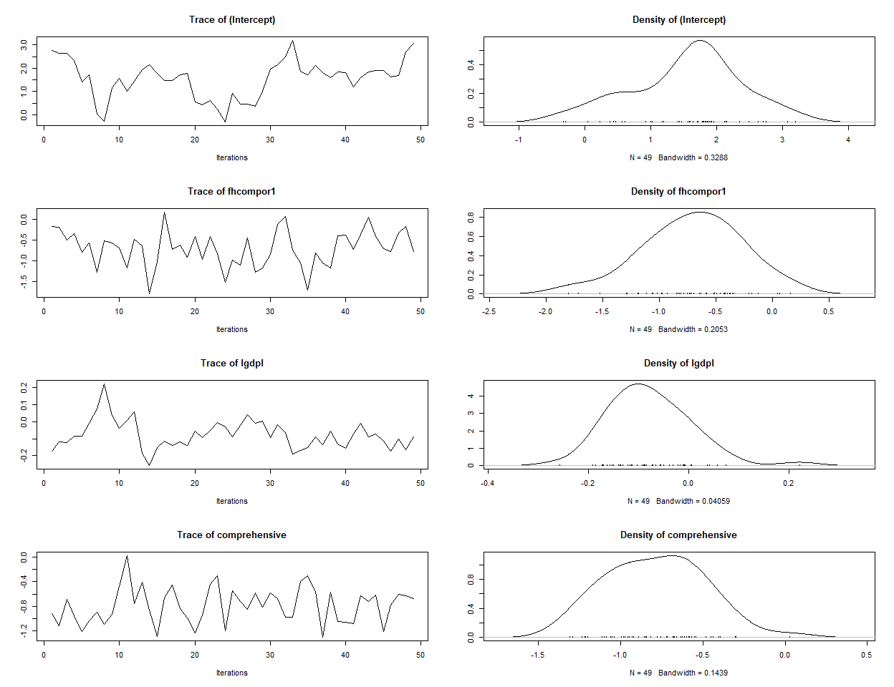

<!-- README.md is generated from README.Rmd. Please edit that file -->

# spatialSPsurv

<!-- badges: start -->

[](https://github.com/Nicolas-Schmidt/spatialSPsurv/actions)
[](https://www.repostatus.org/#active)
[](https://opensource.org/licenses/MIT)
[](https://github.com/Nicolas-Schmidt/BayesMFSurv)
<!-- badges: end -->

Bayesian parametric spatial split-populiation survival models for
clustered event processes. The models account for both structural and
spatial heterogeneity among “at risk” and “immune” populations, and
incorporates time-varying covariates. This package currently implements
Weibull, Exponential and Loglogistic forms for the duration component.
It allows for the creation of spatial weights matrix objects from point
patterns by distance and presents a series of diagnostic tests and plots
for easy visual diagnostics of convergence and spatial effects.

Manual
[**here**](https://github.com/Nicolas-Schmidt/spatialSPsurv/blob/master/man/figures/manual_spatialSPsurv.pdf).

## Installation

``` r
source("https://install-github.me/Nicolas-Schmidt/spatialSPsurv")
```

### Functions

| Function         | Description                                                                                                          |
| ---------------- | -------------------------------------------------------------------------------------------------------------------- |
| `exchangeSPsurv` | Markov Chain Monte Carlo (MCMC) to run Bayesian split population survival model with exchangeable frailties.         |
| `pooledSPsurv`   | Markov Chain Monte Carlo (MCMC) to run Bayesian split population survival model with no frailties                    |
| `spatialSPsurv`  | Markov Chain Monte Carlo (MCMC) to run time-varying Bayesian split population survival model with spatial frailties. |
| `summary`        | returns a summary of exchangeSPsurv, pooledSPsurv or spatialSPsurv object via `coda::summary.mcmc`.                  |
| `spatial_SA`     |                                                                                                                      |
| `SPstats`        | A function to calculate the deviance information criterion (DIC) and Log-likelihood for fitted model oupts.          |

### Example

``` r

library(spatialSPsurv)

## Data
walter <- spduration::add_duration(Walter_2015_JCR,"renewed_war", 
                                   unitID = "id", tID = "year", 
                                   freq = "year", ongoing = FALSE)
walter <- spatialSPsurv::spatial_SA(data = walter, var_ccode = "ccode", threshold = 800L)


set.seed(123456)

tch <- 
    spatialSPsurv(
        duration = duration ~ fhcompor1 + lgdpl + comprehensive + victory + 
                              instabl + intensityln + ethfrac + unpko,
        immune   = cured ~ fhcompor1 + lgdpl + victory,
        Y0       = 't.0',
        LY       = 'lastyear',
        S        = 'sp_id' ,
        data     = walter[[1]],
        N        = 500,
        burn     = 10,
        thin     = 10,
        w        = c(1,1,1),
        m        = 10,
        form     = "Weibull",
        prop.var = 1e-05,
        A        = walter[[2]]
    )

print(tch)
#> Call:
#> spatialSPsurv(duration = duration ~ fhcompor1 + lgdpl + comprehensive + 
#>     victory + instabl + intensityln + ethfrac + unpko, immune = cured ~ 
#>     fhcompor1 + lgdpl + victory, Y0 = "t.0", LY = "lastyear", 
#>     S = "sp_id", A = walter[[2]], data = walter[[1]], N = 500, 
#>     burn = 10, thin = 10, w = c(1, 1, 1), m = 10, form = "Weibull", 
#>     prop.var = 1e-05)
#> 
#> 
#> Iterations = 1:49
#> Thinning interval = 1 
#> Number of chains = 1 
#> Sample size per chain = 49 
#> 
#> Empirical mean and standard deviation for each variable,
#> plus standard error of the mean:
#> 
#> 
#> Duration equation: 
#>                      Mean        SD   Naive SE Time-series SE
#> (Intercept)    1.89866255 1.2509396 0.17870566     0.69851236
#> fhcompor1     -0.84446607 0.4951659 0.07073799     0.10104511
#> lgdpl         -0.05316238 0.1215603 0.01736575     0.05212821
#> comprehensive -0.70682520 0.3301436 0.04716337     0.04716337
#> victory        0.55708089 0.4137637 0.05910910     0.05910910
#> instabl        0.72133602 0.4690292 0.06700417     0.08781194
#> intensityln    0.12217226 0.1173725 0.01676750     0.04682825
#> ethfrac       -0.18496279 0.5341137 0.07630195     0.07630195
#> unpko          0.39261930 0.4932459 0.07046371     0.07046371
#> 
#> Inmune equation: 
#>                   Mean       SD  Naive SE Time-series SE
#> (Intercept)  0.1519895 2.578951 0.3684215      0.3684215
#> fhcompor1   -0.2427989 2.900525 0.4143607      0.6365760
#> lgdpl       -1.8897132 1.402490 0.2003557      0.2003557
#> victory     -2.0062225 4.957126 0.7081608      0.9911410

SPstats(tch)
#> $DIC
#> [1] -29831.72
#> 
#> $Loglik
#> [1] 20960.79
```

## MAP

``` r
spw   <- matrix(apply(tch$W, 2, mean), ncol = 1, nrow = ncol(tch$W))
ccode <- colnames(tch$W)
ISO3  <- countrycode::countrycode(ccode,'gwn','iso3c')
spw   <- data.frame(ccode = ccode, ISO3 = ISO3, spw = spw) 
map   <- rworldmap::joinCountryData2Map(spw, joinCode = "ISO3", nameJoinColumn = "ISO3")
#> 46 codes from your data successfully matched countries in the map
#> 0 codes from your data failed to match with a country code in the map
#> 197 codes from the map weren't represented in your data
rworldmap::mapCountryData(map, nameColumnToPlot = 'spw')
```


