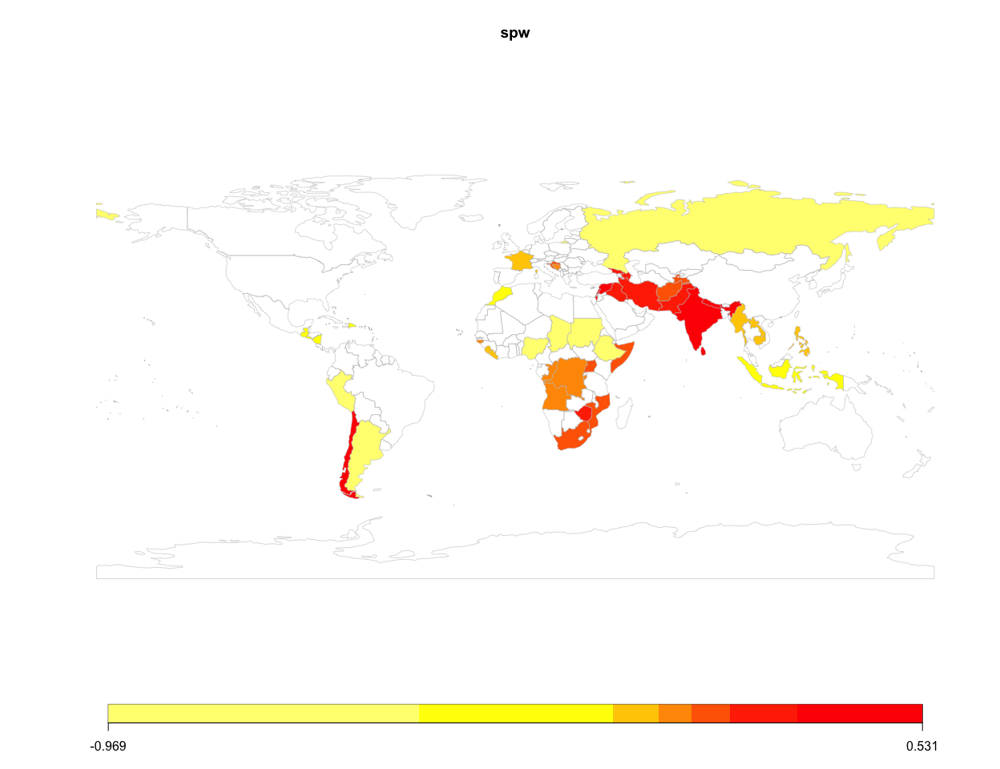
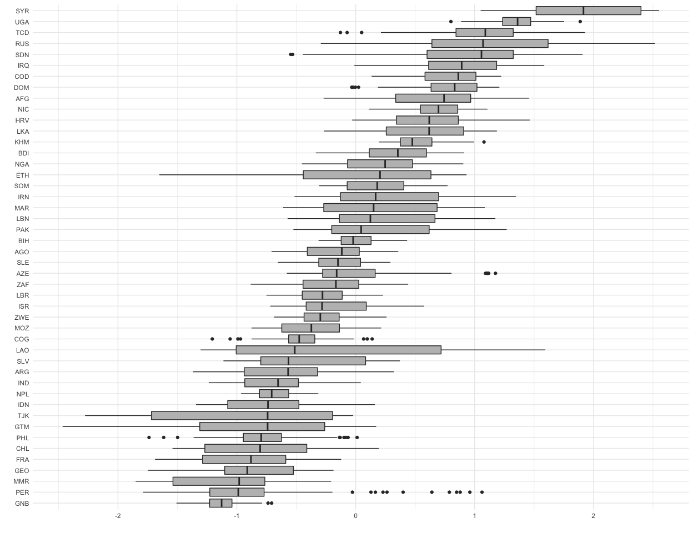

<!-- README.md is generated from README.Rmd. Please edit that file -->

# BayesSPsurv

<!-- badges: start -->

[](https://cran.r-project.org/package=BayesSPsurv)
[](https://github.com/Nicolas-Schmidt/BayesSPsurv/actions)
[](https://www.repostatus.org/#active)
[](https://lifecycle.r-lib.org/articles/stages.html)
[](https://github.com/Nicolas-Schmidt/BayesSPsurv)
[](https://opensource.org/licenses/MIT)

<!-- badges: end -->

**BayesSPsurv** is an R package that provides functions to fit and
assess the performance of the following sets of Bayesian Spatial
split-population (SP) survival (cure) models:

-   Fit the Bayesian Spatial split-population survival model that
    accounts for both structural and spatial heterogeneity. Spatial
    autocorrelation is modeled with spatially weighted frailties, which
    are estimated using a CAR prior.

-   Fit a non-spatial Bayesian SP survival model with exchangeable
    frailties in the split and survival-stage equations.

-   Fit a non-spatial parametric SP survival model with no frailties.

**BayesSPsurv** uses an MCMC algorithm for Bayesian inference (Gibbs
sampling and Metropolis-Hastings) to estimate the models listed above.

### Why BayesSPsurv

Scholars across multiple academic disciplines often analyze
time-to-event data via conventional survival models. While useful, these
models rely on two core assumptions that are not always tenable:

-   That all units will eventually experience the event of interest.

-   That observations are independent from each other after controlling
    for covariates.

**BayesSPsurv** allows users to estimate Bayesian Spatial
split-population (SP) survival (cure) models with spatial frailties in
both the split and survival stages. This accounts for spatial clustering
in the “at risk” and “immune” populations. Users can also incorporate
time-varying covariates. It also includes functions and code for
pre-estimation autocorrelation diagnostics, creation of spatial weight
matrix based on units and adjacencies of interest, and visualization of
results, making **BayesSPsurv** flexible and broadly applicable to a
variety of research areas.

### Functions in the BayesSPsurv Package

| Function         | Description                                                                                                          |
|------------------|----------------------------------------------------------------------------------------------------------------------|
| `spatialSPsurv`  | Markov Chain Monte Carlo (MCMC) to run time-varying Bayesian split population survival model with spatial frailties. |
| `exchangeSPsurv` | Markov Chain Monte Carlo (MCMC) to run Bayesian split population survival model with exchangeable frailties.         |
| `pooledSPsurv`   | Markov Chain Monte Carlo (MCMC) to run Bayesian split population survival model with no frailties.                   |
| `plot_JoinCount` | Conducts Join Count tests to assess spatial clustering or dispersion of categorical variables in the data.           |
| `plot_Moran.I`   | Implements Global Moran I test to evaluate spatial autocorrelation in units’ risk propensity in the data.            |
| `summary`        | Returns a summary of exchangeSPsurv, pooledSPsurv or spatialSPsurv object via `coda::summary.mcmc`.                  |
| `spatial_SA`     | Generates a spatial weights matrix with units and adjacencies defined by the user.                                   |
| `SPstats`        | A function to calculate the deviance information criterion (DIC) and Log-likelihood for fitted model oupUts.         |

### Dependencies

-   Rcpp (&gt;= 1.0.3)
-   RcppArmadillo
-   spduration
-   countrycode
-   progress
-   dplyr
-   ggplot2

### Installation

The latest version of the package (`0.1.3`) is available on [CRAN
R](https://CRAN.R-project.org/package=BayesSPsurv):

``` r
install.packages("BayesSPsurv")
```

To install the development version from GitHub:

``` r
if (!require("remotes")) install.packages("remotes")
remotes::install_github("Nicolas-Schmidt/BayesSPsurv")
```

### Using the Package

We illustrate the functionality of **BayesSPsurv** using data from
[Walter
(2015)](https://journals.sagepub.com/doi/abs/10.1177/0022002714528006)’s
study on post-civil war peace duration. The data is included and
described in the manual’s package.

### Bayesian Spatial Split-Population (SP) Survival Model

`spatialSPsurv` estimates the Bayesian Spatial split-population survival
(cure) model. It includes time-varying covariates *and* spatially
autocorrelated frailties in the model’s split and survival stage. To
allow for easy replication, the example below runs a low number of
iterations (N).

`spatialSPsurv` Weibull model with N = 15,000 is
[here](https://github.com/Nicolas-Schmidt/BayesSPsurv/tree/master/data-raw).

`spatialSPsurv` Log-Logistic model with N = 15,000 is
[here](https://github.com/Nicolas-Schmidt/BayesSPsurv/tree/master/data-raw/data-raw-loglog).

First, load the package.

``` r
library(BayesSPsurv)
```

Second, we add variables that allow us to capture the survival
characteristics of the data.

``` r
walter <- spduration::add_duration(Walter_2015_JCR,"renewed_war", 
                                   unitID = "id", tID = "year", 
                                   freq = "year", ongoing = FALSE)
#> Registered S3 method overwritten by 'quantmod':
#>   method            from
#>   as.zoo.data.frame zoo
#> Warning in attempt_date(data[, tID], freq): Converting to 'Date' class with
#> yyyy-06-30
```

The `spatial_SA` function allows users can create the spatial weights
matrix as follows. Please note that users can specify their own distance
threshold. In this example, we define “proximity” as having capitals
that are within 800 kms.of each other.

``` r
walter <- BayesSPsurv::spatial_SA(data = walter, var_ccode = "ccode", threshold = 800L)
```

We now estimate the **Bayesian Spatial split-population survival
model**.

``` r
set.seed(123456)

model <- spatialSPsurv(
          duration  = duration ~ victory + comprehensive + lgdpl + unpko,
          immune    = atrisk ~ lgdpl,
          Y0        = 't.0',
          LY        = 'lastyear',
          S         = 'sp_id' ,
          data      = walter[[1]],
          N         = 1500,
          burn      = 300,
          thin      = 15,
          w         = c(1,1,1),
          m         = 10,
          form      = "Weibull",
          prop.varV = 1e-05,
          prop.varW = 1e-03,
          A         = walter[[2]]
        )
```

The generic `print()` function displays the results.

``` r
print(model)
#> Call:
#> spatialSPsurv(duration = duration ~ victory + comprehensive + 
#>     lgdpl + unpko, immune = atrisk ~ lgdpl, Y0 = "t.0", LY = "lastyear", 
#>     S = "sp_id", A = walter[[2]], data = walter[[1]], N = 1500, 
#>     burn = 300, thin = 15, w = c(1, 1, 1), m = 10, form = "Weibull", 
#>     prop.varV = 1e-05, prop.varW = 0.001)
#> 
#> 
#> Iterations = 1:80
#> Thinning interval = 1 
#> Number of chains = 1 
#> Sample size per chain = 80 
#> 
#> Empirical mean and standard deviation for each variable,
#> plus standard error of the mean:
#> 
#> 
#> Duration equation: 
#>                    Mean        SD   Naive SE Time-series SE
#> (Intercept)   0.5472465 0.7770281 0.08687438     0.03375775
#> victory       0.1083226 0.5791961 0.06475609     0.09381673
#> comprehensive 0.2390011 0.5841345 0.06530822     0.06530822
#> lgdpl         0.4221808 0.1185057 0.01324934     0.02161274
#> unpko         0.1617510 0.7679051 0.08585440     0.08585440
#> 
#> Immune equation: 
#>                  Mean       SD  Naive SE Time-series SE
#> (Intercept) -0.383487 3.797043 0.4245223      0.5575999
#> lgdpl       -1.461369 1.757769 0.1965245      0.2475315
```

`SPstats()`calculates the Deviance Information Criterion (DIC) and
Log-Likelihood (LL) statistics for the estimated model.

``` r
SPstats(model)
#> $DIC
#> [1] -4783.756
#> 
#> $Loglik
#> [1] 3556.558
```

The following lines of code allow users to substantively interpret the
spatial frailties. They generate a map that helps to determine whether
adjacent units share similar frailty values. Please note that the map
below only illustrates survival-stage (W) frailties. Substituting W for
V in the code below generates a map for the split-stage frailties.

``` r
spw   <- matrix(apply(model$W, 2, mean), ncol = 1, nrow = ncol(model$W))
ccode <- colnames(model$W)
ISO3  <- countrycode::countrycode(ccode,'gwn','iso3c')
spw   <- data.frame(ccode = ccode, ISO3 = ISO3, spw = spw) 
map   <- rworldmap::joinCountryData2Map(spw, joinCode = "ISO3", nameJoinColumn = "ISO3")
#> 46 codes from your data successfully matched countries in the map
#> 0 codes from your data failed to match with a country code in the map
#> 197 codes from the map weren't represented in your data
rworldmap::mapCountryData(map, nameColumnToPlot = 'spw')
```



### Bayesian Exchangeable Split-Population (SP) Survival Model

This model incorporates nonspatial unit-specific i.i.d frailties in the
model’s split-stage (Vi) and survival stage (Wi) as well as time-varying
covariates in each of these two stages.

`exchangeSPsurv` Weibull model with N = 15,000 is
[here](https://github.com/Nicolas-Schmidt/BayesSPsurv/tree/master/data-raw).

`exchangeSPsurv` Log-Logistic model with N = 15,000 is
[here](https://github.com/Nicolas-Schmidt/BayesSPsurv/tree/master/data-raw/data-raw-loglog).

``` r
walter <- spduration::add_duration(Walter_2015_JCR,"renewed_war", 
                                   unitID = "id", tID = "year", 
                                   freq = "year", ongoing = FALSE)
```

Since estimating the Exchangeable model does not require a
spatial-weights matrix (A), users can type the following lines of code
to prepare the data.

``` r
walter$S <- rep(x = 1:length(unique(walter$ccode)), times = rle(walter$ccode)$lengths)
country  <- countrycode::countrycode(unique(walter$ccode),'gwn','iso3c')
```

The model is estimated as follows.

``` r
set.seed(123456)

model <- exchangeSPsurv(
          duration  = duration ~ comprehensive + victory + unpko,
          immune    = atrisk ~ lgdpl,
          Y0        = 't.0',
          LY        = 'lastyear',
          S         = 'S' ,
          data      = walter,
          N         = 1500,
          burn      = 300,
          thin      = 15,
          w         = c(1,1,1),
          m         = 10,
          form      = "Weibull",
          prop.varV = 1e-05,
          prop.varW = 1e-03,
          id_WV     = country
        )
```

You can generate the box-plots for unit-specific split and
survival-stage frailties from the estimated model as follows.

``` r
library(ggplot2)

w_country <- tidyr::pivot_longer(as.data.frame(model$W), cols = 1:ncol(model$W))

ggplot(w_country, aes(x = reorder(factor(name), value, FUN = median), y =  value)) +
    geom_boxplot(fill = 'gray') +  coord_flip() + theme_minimal() + labs(x = "", y = "")
```



## Bayesian Pooled Split-Population (SP) Survival Model

**BayesSPsurv** also fits Bayesian SP survival models without
unit-specific i.i.d. frailties.

`pooledSPsurv` Weibull model with N = 15,000 is
[here](https://github.com/Nicolas-Schmidt/BayesSPsurv/tree/master/data-raw).

`pooledSPsurv` Log-Logistic model with N = 15,000 is
[here](https://github.com/Nicolas-Schmidt/BayesSPsurv/tree/master/data-raw/data-raw-loglog).

``` r

set.seed(123456)

model <-pooledSPsurv(
          duration = duration ~ comprehensive + victory + unpko,
          immune   = atrisk ~ lgdpl,
          Y0       = 't.0',
          LY       = 'lastyear',
          data     = walter,
          N        = 1500,
          burn     = 300,
          thin     = 15,
          w        = c(1,1,1),
          m        = 10,
          form     = "Weibull"
      )
```

Calling the generic `print()` function to display the results.

``` r
print(model)
#> Call:
#> pooledSPsurv(duration = duration ~ comprehensive + victory + 
#>     unpko, immune = atrisk ~ lgdpl, Y0 = "t.0", LY = "lastyear", 
#>     data = walter, N = 1500, burn = 300, thin = 15, w = c(1, 
#>         1, 1), m = 10, form = "Weibull")
#> 
#> 
#> Iterations = 1:80
#> Thinning interval = 1 
#> Number of chains = 1 
#> Sample size per chain = 80 
#> 
#> Empirical mean and standard deviation for each variable,
#> plus standard error of the mean:
#> 
#> 
#> Duration equation: 
#>                     Mean        SD   Naive SE Time-series SE
#> (Intercept)   3.19047012 1.1807620 0.13201321     0.45104567
#> comprehensive 0.30823578 0.7420113 0.08295939     0.08295939
#> victory       0.05918528 0.5611721 0.06274094     0.06274094
#> unpko         0.10013585 0.8112391 0.09069929     0.09069929
#> 
#> Immune equation: 
#>                  Mean       SD  Naive SE Time-series SE
#> (Intercept) -2.595263 6.259883 0.6998762       1.530030
#> lgdpl       -1.782770 3.348600 0.3743848       1.116384
```

### Parallel MCMC

``` r
library(doParallel)
library(snow)
library(doRNG)
library(coda)


workers <- makeCluster(detectCores() - 1 ,type = "SOCK", outfile = "log.txt")
registerDoParallel(workers)

inivals <- c(0, 1, 10, 50)

data(Walter_2015_JCR)
walter <- spduration::add_duration(Walter_2015_JCR,"renewed_war", unitID = "id",
                       tID = "year", freq = "year", ongoing = FALSE)

walter <- spatial_SA(data = walter, var_ccode = "ccode", threshold = 800L)
set.seed(123456)

ctype = rbind
t = 1
tm1 = system.time({
    Out <- foreach(i = 1:length(inivals),.combine = ctype, .errorhandling = 'stop',
                   .packages='BayesSPsurv',
                   .options.RNG = t) %dorng%
        {spatialSPsurv(
            duration  = duration ~ victory + comprehensive + lgdpl + unpko,
            immune    = atrisk ~ lgdpl,
            Y0        = 't.0',
            LY        = 'lastyear',
            S         = 'sp_id' ,
            data      = walter[[1]],
            N         = 1500,
            burn      = 300,
            thin      = 15,
            w         = c(1,1,1),
            m         = 10,
            ini.beta  = inivals[i],
            ini.gamma = inivals[i],
            ini.W     = inivals[i],
            ini.V     = inivals[i],
            form      = "Weibull",
            prop.varV = 1e-05,
            prop.varW = 1e-03,
            A         = walter[[2]])
        }
})


betas  <- do.call("rbind", lapply(Out[1:4], function(x) as.mcmc.list(as.mcmc(x))))
gammas <- do.call("rbind", lapply(Out[5:8], function(x) as.mcmc.list(as.mcmc(x))))


##  Gelman Diagnostics

coda::gelman.diag(betas)
#> Potential scale reduction factors:
#> 
#>               Point est. Upper C.I.
#> (Intercept)         1.16       1.45
#> victory             1.21       1.51
#> comprehensive       1.21       1.29
#> lgdpl               1.27       1.60
#> unpko               1.15       1.19
#> 
#> Multivariate psrf
#> 
#> 1.07
coda::gelman.diag(gammas)
#> Potential scale reduction factors:
#> 
#>             Point est. Upper C.I.
#> (Intercept)       1.25       1.74
#> lgdpl             1.12       1.39
#> 
#> Multivariate psrf
#> 
#> 1.23
```
