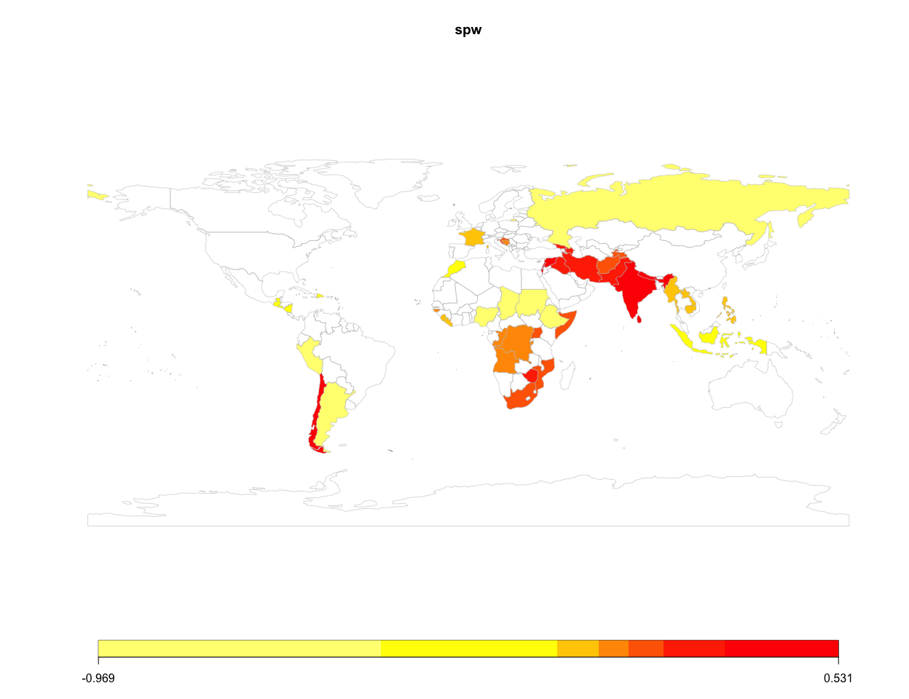
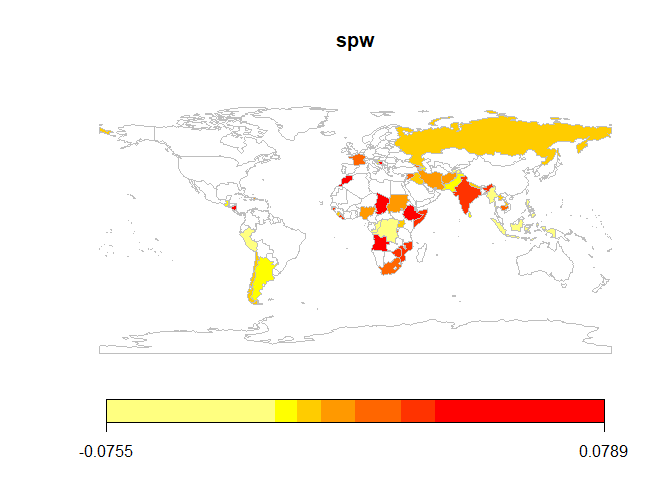

<!-- README.md is generated from README.Rmd. Please edit that file -->

# BayesSPsurv

<!-- badges: start -->

[](https://cran.r-project.org/package=BayesSPsurv)
[](https://github.com/Nicolas-Schmidt/BayesSPsurv/actions)
[](https://www.repostatus.org/#active)
[](https://www.tidyverse.org/lifecycle/#stable)
[](https://github.com/Nicolas-Schmidt/BayesSPsurv)
[](https://opensource.org/licenses/MIT)

<!-- badges: end -->

### Description

Parametric spatial split-population (SP) survival models for clustered
event processes. The models account for both structural and spatial
heterogeneity among “at risk” and “immune” populations, and incorporates
time-varying covariates. This package currently implements Weibull,
Exponential and Log-logistic forms for the duration component, and
includes functions for a series of diagnostic tests and plots to easily
visualize autocorrelation, convergence and spatial effects. The user can
also create their own spatial weights matrix based on their units and
adjacencies of interest, making the use of these models flexible and
broadly applicable to a variety of research areas.

### Installation

The latest version of the package (`0.1.1`) is available on [CRAN
R](https://CRAN.R-project.org/package=BayesSPsurv):

``` r
install.packages("BayesSPsurv")
```

To install the development version from GitHub:

``` r
if (!require("remotes")) install.packages("remotes")
remotes::install_github("Nicolas-Schmidt/BayesSPsurv")
```

### Functions

| Function          | Description                                                                                                          |
| ----------------- | -------------------------------------------------------------------------------------------------------------------- |
| `spatialSPsurv`   | Markov Chain Monte Carlo (MCMC) to run time-varying Bayesian split population survival model with spatial frailties. |
| `exchangeSPsurv`  | Markov Chain Monte Carlo (MCMC) to run Bayesian split population survival model with exchangeable frailties.         |
| `pooledSPsurv`    | Markov Chain Monte Carlo (MCMC) to run Bayesian split population survival model with no frailties.                   |
| `plot_JointCount` | Conducts Join Count tests to assess spatial clustering or dispersion of categorical variables in the data.           |
| `plot_Moran.I`    | Implements Global Moran I test to evaluate spatial autocorrelation in units’ risk propensity in the data.            |
| `summary`         | Returns a summary of exchangeSPsurv, pooledSPsurv or spatialSPsurv object via `coda::summary.mcmc`.                  |
| `spatial_SA`      | Generates a spatial weights matrix with units and adjacencies defined by the user.                                   |
| `SPstats`         | A function to calculate the deviance information criterion (DIC) and Log-likelihood for fitted model oupUts.         |

### Example

### Data

We illustrate the functionality of `BayesSPsurv` using data from Walter
(2015) that is included and described in the package.

### Bayesian Spatial Split-Population (SP) Survival Model

`spatialSPsurv` estimates the Bayesian Spatial split-population survival
(cure) model, which includes not only time-varying covariates but also
spatially autocorrelated frailties in the model’s split and survival
stage. To allow for easy replication, the examples below run a low
number of iterations (N).

`spatialSPsurv` Weibull model with N = 15,000 is
[here](https://github.com/Nicolas-Schmidt/BayesSPsurv/tree/master/data-raw).

`spatialSPsurv` Log-Logistic model with N = 15,000 is
[here](https://github.com/Nicolas-Schmidt/BayesSPsurv/tree/master/data-raw/data-raw-loglog).

``` r

library(BayesSPsurv)

## Data
walter <- spduration::add_duration(Walter_2015_JCR,"renewed_war", 
                                   unitID = "id", tID = "year", 
                                   freq = "year", ongoing = FALSE)
#> Registered S3 method overwritten by 'quantmod':
#>   method            from
#>   as.zoo.data.frame zoo
walter <- BayesSPsurv::spatial_SA(data = walter, var_ccode = "ccode", threshold = 800L)


set.seed(123456)

model <- 
    spatialSPsurv(
        duration  = duration ~ fhcompor1 + lgdpl + comprehensive + victory + 
                    instabl + intensityln + ethfrac + unpko,
        immune    = cured ~ fhcompor1 + lgdpl + victory,
        Y0        = 't.0',
        LY        = 'lastyear',
        S         = 'sp_id' ,
        data      = walter[[1]],
        N         = 500,
        burn      = 10,
        thin      = 10,
        w         = c(1,1,1),
        m         = 10,
        form      = "Weibull",
        prop.varV = 1e-05,
        prop.varW = 1e-03,
        A         = walter[[2]]
    )

print(model)
#> Call:
#> spatialSPsurv(duration = duration ~ fhcompor1 + lgdpl + comprehensive + 
#>     victory + instabl + intensityln + ethfrac + unpko, immune = cured ~ 
#>     fhcompor1 + lgdpl + victory, Y0 = "t.0", LY = "lastyear", 
#>     S = "sp_id", A = walter[[2]], data = walter[[1]], N = 500, 
#>     burn = 10, thin = 10, w = c(1, 1, 1), m = 10, form = "Weibull", 
#>     prop.varV = 1e-05, prop.varW = 0.001)
#> 
#> 
#> Iterations = 1:49
#> Thinning interval = 1 
#> Number of chains = 1 
#> Sample size per chain = 49 
#> 
#> Empirical mean and standard deviation for each variable,
#> plus standard error of the mean:
#> 
#> 
#> Duration equation: 
#>                      Mean         SD   Naive SE Time-series SE
#> (Intercept)    1.12175943 0.72782728 0.10397533     0.20640125
#> fhcompor1     -0.94228430 0.40918165 0.05845452     0.05293352
#> lgdpl         -0.01583485 0.09102508 0.01300358     0.03297101
#> comprehensive -0.66300249 0.31027598 0.04432514     0.04432514
#> victory        0.25435614 0.46844978 0.06692140     0.06692140
#> instabl        0.67515125 0.45626742 0.06518106     0.06518106
#> intensityln    0.16878473 0.08716617 0.01245231     0.04559517
#> ethfrac       -0.02405502 0.58857859 0.08408266     0.08677714
#> unpko          0.44344674 0.63423139 0.09060448     0.11244357
#> 
#> Inmune equation: 
#>                    Mean       SD  Naive SE Time-series SE
#> (Intercept) -0.52444626 4.385563 0.6265090      1.0810530
#> fhcompor1   -0.30397958 4.471833 0.6388332      1.2863354
#> lgdpl       -1.50327218 1.260961 0.1801372      0.1801372
#> victory     -0.02088428 2.335731 0.3336758      0.3336758

SPstats(model)
#> $DIC
#> [1] -26548.19
#> 
#> $Loglik
#> [1] 18037.57

# ~~~~~~~~~~~~~~~
# Choropleth Map
# ~~~~~~~~~~~~~~~

spw   <- matrix(apply(model$W, 2, mean), ncol = 1, nrow = ncol(model$W))
ccode <- colnames(model$W)
ISO3  <- countrycode::countrycode(ccode,'gwn','iso3c')
spw   <- data.frame(ccode = ccode, ISO3 = ISO3, spw = spw) 
map   <- rworldmap::joinCountryData2Map(spw, joinCode = "ISO3", nameJoinColumn = "ISO3")
#> 46 codes from your data successfully matched countries in the map
#> 0 codes from your data failed to match with a country code in the map
#> 197 codes from the map weren't represented in your data
rworldmap::mapCountryData(map, nameColumnToPlot = 'spw')
```



### Bayesian Exchangeable Split-Population (SP) Survival Model

This model includes nonspatial unit-specific i.i.d frailties in the
model’s split-stage (Vi) and survival stage (Wi) as well as time-varying
covariates in each of these two stages.

`exchangeSPsurv` Weibull model with N = 15,000 is
[here](https://github.com/Nicolas-Schmidt/BayesSPsurv/tree/master/data-raw).

`exchangeSPsurv` Log-Logistic model with N = 15,000 is
[here](https://github.com/Nicolas-Schmidt/BayesSPsurv/tree/master/data-raw/data-raw-loglog).

``` r
walter <- spduration::add_duration(Walter_2015_JCR,"renewed_war", 
                                   unitID = "id", tID = "year", 
                                   freq = "year", ongoing = FALSE)

walter$S     <- rep(x = 1:length(unique(walter$ccode)), times = rle(walter$ccode)$lengths)
country <- countrycode::countrycode(unique(walter$ccode),'gwn','iso3c')

set.seed(123456)

model <-
    exchangeSPsurv(
        duration  = duration ~ fhcompor1 + lgdpl + comprehensive + victory +
                    instabl + intensityln + ethfrac + unpko,
        immune    = cured ~ fhcompor1 + lgdpl + victory,
        Y0        = 't.0',
        LY        = 'lastyear',
        S         = 'S' ,
        data      = walter,
        N         = 500,
        burn      = 10,
        thin      = 10,
        w         = c(1,1,1),
        m         = 10,
        form      = "loglog",
        prop.varV = 1e-05,
        prop.varW = 1e-03,
        id_WV    = country
    )


library(ggplot2)

w_country <- tidyr::pivot_longer(as.data.frame(model$W), cols = 1:ncol(model$W))

ggplot(w_country, aes(x = reorder(factor(name), value, FUN = median), y =  value)) +
    geom_boxplot(fill = 'gray') +  coord_flip() + theme_minimal() + labs(x = "", y = "")
```



## Bayesian Pooled Split-Population (SP) Survival Model

Bayesian SP survical model without unit-specific i.i.d frailties.

`pooledSPsurv` Weibull model with N = 15,000 is
[here](https://github.com/Nicolas-Schmidt/BayesSPsurv/tree/master/data-raw).

`pooledSPsurv` Log-Logistic model with N = 15,000 is
[here](https://github.com/Nicolas-Schmidt/BayesSPsurv/tree/master/data-raw/data-raw-loglog).

``` r


set.seed(123456)

model <-
     pooledSPsurv(
         duration = duration ~ fhcompor1 + lgdpl + comprehensive + victory +
             instabl + intensityln + ethfrac + unpko,
         immune   = cured ~ fhcompor1 + lgdpl + victory,
         Y0       = 't.0',
         LY       = 'lastyear',
         data     = walter,
         N        = 500,
         burn     = 10,
         thin     = 10,
         w        = c(1,1,1),
         m        = 10,
         form     = "Weibull"
     )

print(model)
#> Call:
#> pooledSPsurv(duration = duration ~ fhcompor1 + lgdpl + comprehensive + 
#>     victory + instabl + intensityln + ethfrac + unpko, immune = cured ~ 
#>     fhcompor1 + lgdpl + victory, Y0 = "t.0", LY = "lastyear", 
#>     data = walter, N = 500, burn = 10, thin = 10, w = c(1, 1, 
#>         1), m = 10, form = "Weibull")
#> 
#> 
#> Iterations = 1:49
#> Thinning interval = 1 
#> Number of chains = 1 
#> Sample size per chain = 49 
#> 
#> Empirical mean and standard deviation for each variable,
#> plus standard error of the mean:
#> 
#> 
#> Duration equation: 
#>                      Mean        SD   Naive SE Time-series SE
#> (Intercept)    1.41645165 0.7630170 0.10900243     0.25754335
#> fhcompor1     -0.73118837 0.4446105 0.06351579     0.06351579
#> lgdpl         -0.04603712 0.1262530 0.01803614     0.05548108
#> comprehensive -0.64177732 0.3831055 0.05472936     0.04350588
#> victory        0.45487990 0.3810381 0.05443401     0.05443401
#> instabl        0.66023159 0.4724143 0.06748776     0.06748776
#> intensityln    0.17466335 0.1069724 0.01528177     0.04389407
#> ethfrac       -0.01717105 0.5198537 0.07426481     0.07426481
#> unpko          0.44262641 0.5719971 0.08171387     0.08171387
#> 
#> Inmune equation: 
#>                   Mean       SD  Naive SE Time-series SE
#> (Intercept) -1.3166061 4.668150 0.6668786      1.5578413
#> fhcompor1   -2.5921085 5.214286 0.7448980      0.5620853
#> lgdpl       -5.3924239 4.929649 0.7042356      1.5028341
#> victory     -0.1413459 6.253230 0.8933186      2.5384936
```
